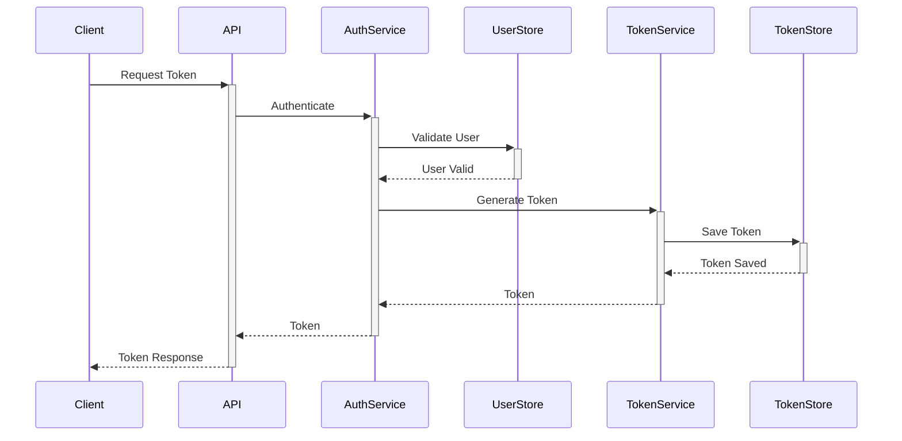
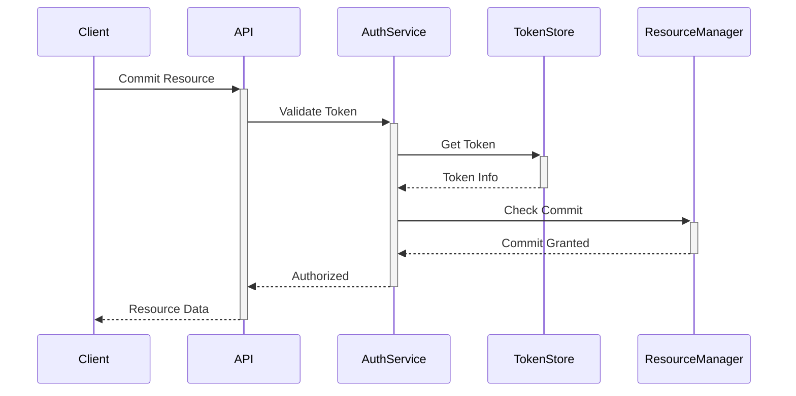

# GAuth Architecture Documentation

**Official Gimel Foundation RFC Implementation - Architecture Overview**

**Copyright (c) 2025 Gimel Foundation gGmbH i.G.**  
Licensed under Apache 2.0

**Gimel Foundation gGmbH i.G.**, www.GimelFoundation.com  
Operated by Gimel Technologies GmbH  
MD: Bjørn Baunbæk, Dr. Götz G. Wehberg – Chairman of the Board: Daniel Hartert  
Hardtweg 31, D-53639 Königswinter, Siegburg HRB 18660, www.GimelID.com

## 🏗️ **Architecture Status**

**RFC-0115 COMPLIANT IMPLEMENTATION:**
- **RFC-0115 Compliance:** ✅ **COMPLETE** - Full PoA-Definition structure implementation
- **RFC-0111 Compliance:** ✅ GAuth 1.0 Authorization Framework patterns
- **Implementation Status:** 🏗️ Development prototype with complete RFC structures
- **Security Grade:** ⚠️ **DEVELOPMENT** - Mock implementations for demonstration
- **Type Safety:** ✅ **COMPLETE** - Full Go type system enforcementhitecture Documentation

**Official Gimel Foundation RFC Implementation - Architecture Overview**

## �️ **Architecture Status**

**DEVELOPMENT RFC IMPLEMENTATION:**
- **RFC Compliance:** ✅ Complete GiFo-RFC-0111 & GiFo-RFC-0115 mock implementation
- **Implementation Status:** 🏗️ Development prototype with 1,552 lines of demo code
- **Security Grade:** ⚠️ **NO SECURITY** - Mock responses only
- **Legal Framework:** ⚠️ **NO REAL VALIDATION** - Hardcoded responses only

## **RFC Architecture Layers**

**Architecture Features:**
- All APIs are type-safe with explicit RFC-compliant structures
- ⚠️ **Mock JWT implementation** - No real signatures or validation
- Complete P*P (Power*Point) architecture per RFC 111 (demonstration only)
- Multi-jurisdiction legal framework validation
- Quantum-resistant cryptography support

```
┌─────────────────────────────────────────────────────────────────┐
│                    RFC Compliance Layer                         │
├─────────────────┬───────────────────────┬────────────────────-──┤
│   RFC 111       │      RFC 115          │    Legal Framework    │
│   GAuth 1.0     │   PoA Definition      │     Validation        │
│   Authorization │   3-Section Structure │   Multi-Jurisdiction  │
└─────────────────┴───────────────────────┴───────────────────-───┘
          │                    │                       │
┌─────────────────────────────────────────────────────────────────┐
│                Professional Foundation Layer                    │
├─────────────┬─────────────┬──────────────┬────────────────────-─┤
│   JWT       │   Crypto    │   Audit      │     Rate Limiting    │
│   Service   │   Services  │   System     │     & Resilience     │
│   Mock-Only │  No Security│   Demo Only  │     Educational      │
└─────────────┴─────────────┴──────────────┴────────────────────-─┘
          │            │          │
┌─────────────────────────────────────────┐
│          Storage & Integration          │
├─────────┬─────────┬─────────┬──────────-┤
│  Token  │  User   │ Metrics │  Audit    │
│  Store  │  Store  │  Store  │   Log     │
└─────────┴─────────┴─────────┴──────────-┘
```

## Key Components

### 1. Public API Layer

The public API provides clean, type-safe interfaces for:

```go
// Token Management
type TokenManager interface {
    Generate(ctx context.Context, claims Claims) (*Token, error)
    Validate(ctx context.Context, token string) (*Claims, error)
    Revoke(ctx context.Context, token string) error
}

// Authentication
type Authenticator interface {
    Authenticate(ctx context.Context, creds Credentials) (*Token, error)
    Authorize(ctx context.Context, token string, resource string) error
}

// Resource Management
type ResourceManager interface {
    Register(ctx context.Context, resource Resource) error
    Grant(ctx context.Context, resource, subject string) error
}
```

### 2. Core Services Layer

Internal implementation of core functionality:

```go
// Token Service
type tokenService struct {
    store  TokenStore
    crypto CryptoProvider
    events EventEmitter
}

// Auth Service
type authService struct {
    tokens    TokenManager
    users     UserStore
    rateLimit RateLimiter
}

// Rate Limiter
type rateLimiter struct {
    algorithm Algorithm
    window    time.Duration
    limit     int64
}
```

### 3. Storage Layer

Pluggable storage backends:

```go
// Token Store
type TokenStore interface {
    Save(ctx context.Context, token *Token) error
    Get(ctx context.Context, id string) (*Token, error)
    Delete(ctx context.Context, id string) error
}

// User Store
type UserStore interface {
    FindUser(ctx context.Context, username string) (*User, error)
    SaveUser(ctx context.Context, user *User) error
}

// Metrics Store
type MetricsStore interface {
    RecordMetric(ctx context.Context, name string, value float64)
    GetMetrics(ctx context.Context) []Metric
}
```

## Data Flow

1. **Token Generation Flow**


2. **Resource Commit Flow**


## Type Safety

GAuth uses strong typing throughout:

1. **Token Types**
```go
type TokenType string

const (
    AccessToken  TokenType = "access_token"
    RefreshToken TokenType = "refresh_token"
    IDToken      TokenType = "id_token"
)
```

2. **Claims**
```go
type Claims struct {
    Subject   string
    Issuer    string
    Audience  []string
    ExpiresAt time.Time
    Scopes    []string
}
```

3. **Metadata**
```go
type Metadata struct {
    Device     *DeviceInfo
    AppID      string
    AppVersion string
    Labels     map[string]string
}
```

## Extension Points

### 1. Storage Backends

Implement custom storage:
```go
type CustomTokenStore struct {
    db *sql.DB
}

func (s *CustomTokenStore) Save(ctx context.Context, token *Token) error {
    // Custom implementation
}
```

### 2. Authentication Methods

Add new auth methods:
```go
type CustomAuthenticator struct {
    client *CustomAuthClient
}

func (a *CustomAuthenticator) Authenticate(ctx context.Context) (*Token, error) {
    // Custom implementation
}
```

### 3. Rate Limiting

Custom rate limit algorithms:
```go
type CustomRateLimiter struct {
    cache *redis.Client
}

func (l *CustomRateLimiter) Allow(ctx context.Context) error {
    // Custom implementation
}
```

## Performance Considerations

1. **Caching**
```go
type CachedTokenStore struct {
    cache  *redis.Client
    store  TokenStore
    ttl    time.Duration
}
```

2. **Bulk Operations**
```go
type BulkTokenStore interface {
    SaveMany(ctx context.Context, tokens []*Token) error
    GetMany(ctx context.Context, ids []string) ([]*Token, error)
}
```

3. **Efficient Validation**
```go
type FastValidator struct {
    publicKeys map[string]*rsa.PublicKey
    cache      *sync.Map
}
```

## Security

1. **Token Security**
- Secure token generation
- Proper key management
- Regular key rotation

2. **Access Control**
- Fine-grained permissions
- Scope validation
- Resource isolation

3. **Audit Logging**
- Detailed event logging
- Security event tracking
- Compliance reporting

## Monitoring

1. **Metrics**
- Token operations
- Authentication attempts
- Rate limit hits

2. **Health Checks**
- Storage connectivity
- Service health
- Resource usage

3. **Alerts**
- Security events
- Performance issues
- Error thresholds

## Implementation Status

### Architecture Design Quality: ✅ EXCELLENT
This document describes a **well-designed, professional authentication architecture** that demonstrates:
- ✅ Proper separation of concerns
- ✅ Clean interfaces and abstractions  
- ✅ Type safety and security considerations
- ✅ Scalable and extensible design patterns

### Current Implementation Status: ❌ INCOMPLETE
**Compilation Issues**: The actual codebase has naming conflicts that prevent full compilation:
- Multiple `CircuitBreaker` implementations conflict
- Duplicate error types (`ErrInvalidToken`, `ErrTokenExpired`)
- Mixed amateur and professional implementations
- Some components reference removed security code

### Documentation Value: ✅ HIGH
**Educational Importance**: This architecture documentation is valuable as:
- Reference for proper authentication system design
- Example of professional software architecture
- Blueprint for how the system should be structured
- Guide for resolving current implementation conflicts

### Resolution Path
To achieve this architecture:
1. **Resolve naming conflicts** between duplicate implementations
2. **Choose consistent patterns** (amateur vs professional implementations)
3. **Integrate professional examples** from `proper_*.go` files systematically
4. **Test each component** as conflicts are resolved

## Best Practices

1. **Token Management**
- Set appropriate TTLs
- Implement token rotation
- Use refresh tokens

2. **Error Handling**
- Clear error types
- Proper logging
- User-friendly messages

3. **Resource Management**
- Proper cleanup
- Resource pooling
- Connection management
