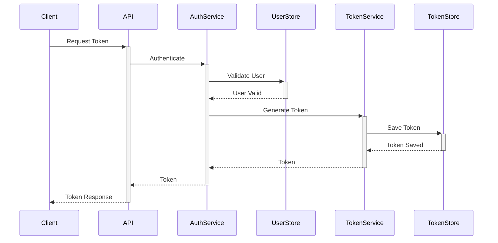
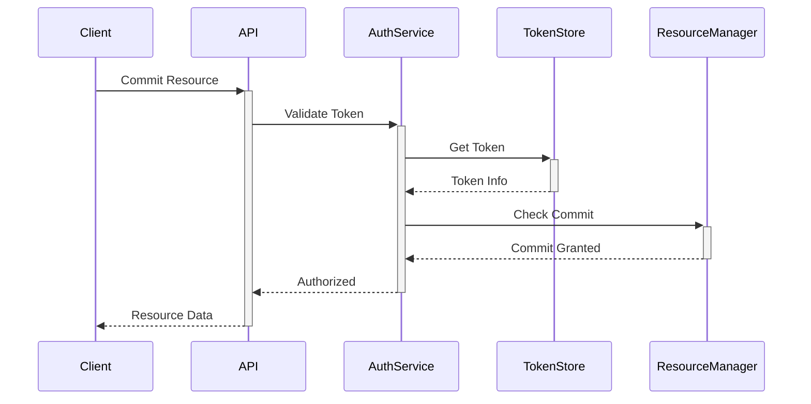

# GAuth Architecture Documentation (Beta / NOT Production Ready)

> Last Updated: 2025-10-19
> Status: Active

**Beta RFC Demonstration – Architecture Overview (NOT Production Ready)**
See root `DISCLAIMER.md` for a consolidated list of intentionally missing production controls.

**Copyright (c) 2025 Gimel Foundation gGmbH i.G.**
Licensed under Apache 2.0

**Gimel Foundation gGmbH i.G.**, www.GimelFoundation.com
Operated by Gimel Technologies GmbH
MD: Bjørn Baunbæk, Dr. Götz G. Wehberg – Chairman of the Board: Daniel Hartert
Hardtweg 31, D-53639 Königswinter, Siegburg HRB 18660, www.GimelID.com

## 🏗️ **Architecture Status (Beta – NOT Production Ready)**

**RFC-0115 STRUCTURAL COVERAGE (Beta Demonstration):**
- **RFC-0115 Compliance:** ✅ **COMPLETE** - Full PoA-Definition structure implementation
- **RFC-0111 Patterns Demonstrated:** ✅ GAuth 1.0 Authorization Framework concepts (illustrative only)
- **Implementation Status:** 🏗️ Development prototype with complete RFC structures
- **Security Grade:** ⚠️ **BETA DEMONSTRATION / NOT PRODUCTION READY** - Mock / minimal implementations for evaluation
- **Type Safety:** ✅ **COMPLETE** - Full Go type system enforcementhitecture Documentation

> **Disclaimer:** This file describes an *aspirational beta demonstration architecture*. The repository is **NOT production ready**. Critical security, durability, compliance, scalability, and operational controls are intentionally omitted to keep concepts approachable. Do **NOT** deploy as-is for real users, regulated data, or commercial purposes.

**Missing for production (non-exhaustive):** Threat modeling, hardened cryptography (key rotation, algorithm agility, KID sets, replay protection), policy engine (OPA/CEL) with versioned change control, multi-tenant isolation, persistent transactional storage, secure secret & key management (KMS/HSM), structured redacted logging, metrics + tracing + alerting stack, rate limiting & anomaly detection, fuzzing & formal verification, supply-chain attestation (SBOM signing, provenance), compliance alignment (GDPR, SOC2), operational runbooks and DR processes.

## 📘 Architecture Decision Records
See `ADR_INDEX.md` for a catalog of decisions. Latest addition: `ADR-capability-governance.md` covering capability registry schema versioning, canonical hash anchoring, transactional loader atomicity, and audit pagination.

Key rationale:
- Deterministic capability ordering → reproducible integrity hash & stable discovery surface.
- Transactional validation prevents partial state corruption on failed reloads.
- Paginated audit export supports operational investigations at scale.
- Schema versioning establishes forward-compatibility and allows future multi-version negotiation.

Planned follow-ups (anchoring ADR forthcoming): external publication of capability registry hash (timestamp / transparency log) and signed capability file ingestion.

## �️ **Architecture Status (Beta Demo)**

**BETA RFC IMPLEMENTATION:**
- **RFC Compliance:** ✅ Complete GiFo-RFC-0111 & GiFo-RFC-0115 mock implementation
- **Implementation Status:** 🏗️ Development prototype with 1,552 lines of demo code
- **Security Grade:** ⚠️ **NO SECURITY** - Mock responses only
- **Legal Framework:** ⚠️ **NO REAL VALIDATION** - Hardcoded responses only

## **RFC Architecture Layers**

**Architecture Features (Demonstration Scope):**
- All APIs are type-safe with explicit RFC-compliant structures
- ⚠️ **Simplified token/signing logic** – Beta demo HMAC usage only; lacks full claims validation, rotation, KID management, or hardened parsing.
- Complete P*P (Power*Point) architecture per RFC 111 (demonstration only)
- Illustrative multi-jurisdiction placeholders (no enforceable validation)
- References to quantum resistance are conceptual only (no implementation)

```
┌─────────────────────────────────────────────────────────────────┐
│                    RFC Compliance Layer                         │
├─────────────────┬───────────────────────┬────────────────────-──┤
│   RFC 111       │      RFC 115          │    Legal Framework    │
│   GAuth 1.0     │   PoA Definition      │     Validation        │
│   Authorization │   3-Section Structure │   Multi-Jurisdiction  │
└─────────────────┴───────────────────────┴───────────────────-───┘
          │                    │                       │
┌─────────────────────────────────────────────────────────────────┐
│                Professional Foundation Layer                    │
├─────────────┬─────────────┬──────────────┬────────────────────-─┤
│   JWT       │   Crypto    │   Audit      │     Rate Limiting    │
│   Service   │   Services  │   System     │     & Resilience     │
│   Mock-Only │ No Security │   Demo Only  │     Beta Demo        │
└─────────────┴─────────────┴──────────────┴────────────────────-─┘
          │            │          │
┌─────────────────────────────────────────┐
│          Storage & Integration          │
├─────────┬─────────┬─────────┬──────────-┤
│  Token  │  User   │ Metrics │  Audit    │
│  Store  │  Store  │  Store  │   Log     │
└─────────┴─────────┴─────────┴──────────-┘
```

## Key Components (Conceptual)

### Test Execution Flags (Lifecycle & Capability Governance)

For deterministic lifecycle/capability tests the server offers environment flags to reduce noise:

| Flag | Effect |
|------|--------|
| GAUTH_CAPABILITY_ENFORCE | Enables capability mapping enforcement for actions |
| GAUTH_CAP_LIFECYCLE_SUNSET_ENFORCE | Denies usage of capabilities after `sunset_after` timestamp |
| GAUTH_DISABLE_BG_POLLS | Suppresses background persistence / anomaly sampler loops |
| GAUTH_SKIP_SMOKETEST | Skips ancillary CSP smoketest during isolated runs |
| GAUTH_DEBUG_ROUTES | When `1`, logs all registered routes at startup (otherwise silent) |
| SKIP_WEB_ASSETS | When `1`, skips JS bundling for faster, quieter Go-only test runs |
| GAUTH_TEST_TRACE_SIGPIPE | When `1`, enables early TestMain heartbeat tracing (stderr) |
| GAUTH_TEST_TRACE_HEARTBEAT_MS | Optional override of heartbeat phase duration (default ~120ms) |

Example single-test invocation:

```bash
GAUTH_DISABLE_BG_POLLS=1 GAUTH_SKIP_SMOKETEST=1 go test -run ^TestCapabilitySunsetEnforcement$ -count=1 -v ./web
```

### Lifecycle Timeline & Legacy Alias

The lifecycle timeline endpoint records token & delegation status transitions (each POST to `/api/v1/token/status/update` or `/api/v1/delegation/status/update`). Events are stored in a per-entity ring buffer (size bounded by an internal `lifecycleCap`) and exposed via a consolidated query API supporting:

* Filtering: `entity_type`, `entity_id`, `since` (unix seconds), `outcome`, `reason`
* Pagination: `limit` (<=250) and `cursor` (exclusive event ID)
* Export: `?format=csv` or `Accept: text/csv`

Current public (beta) path: `/api/v1/beta/lifecycle/timeline`

Legacy compatibility alias (added during the beta refactor): `/api/governance/lifecycle_timeline`

Rationale for alias:
1. Existing tests (pagination + CSV) referenced the older governance path and expected non-empty results.
2. Refactor introduced only the beta namespaced route; tests began failing with 404 → later 200 but empty events.
3. Alias preserves backward compatibility while beta namespace remains the forward path.

Test guidance:
* Always seed at least one lifecycle event before asserting pagination counts. A delegation init (`active` status) or token status transition suffices.
* Without seeding, a first-page query may legitimately return zero events; tests should not treat this as failure unless they explicitly seed.
* Tests have been migrated to the beta path (`/api/v1/beta/lifecycle/timeline`); the legacy path now emits a `[deprecate]` stderr warning when invoked.
* New tests should exclusively use the beta path; legacy alias is scheduled for removal after warning period.
* Set `GAUTH_DISABLE_LEGACY_GOVERNANCE_ALIAS=1` to suppress registration of the legacy alias entirely (will return 404). Use this in CI to surface accidental legacy usage early.

CSV header shape: `entity_type,entity_id,old_status,new_status,outcome,reason,latency_ns,at`

Pagination semantics:
* `cursor` is the ID of the last event from previous page; the event matching the cursor is excluded from subsequent results.
* Ordering is reverse chronological per entity buffer scan until `limit` is met.

Deprecation plan (consolidated):
* Phase 1 (completed): tests migrated to beta path; alias retained for external consumers.
* Phase 2 (active): alias emits `[deprecate]` warning on each invocation.
* Phase 3 (pending): remove alias once external consumers confirm migration; update GAP_MATRIX & API reference.
* Phase 4 (optional hardening): enable `GAUTH_DISABLE_LEGACY_GOVERNANCE_ALIAS=1` by default in CI, then delete code path after one release cycle.

Edge Cases:
* Requests with future `since` yield zero events (used by tests to exercise filter path).
* Invalid `limit` (>250 or <=0) coerced to default (100).
* Unknown `entity_type` simply results in zero matches; no error status returned.

Shutdown support: call `srv.Shutdown()` in tests to flush persistence and stop loops gracefully.

Test environment isolation:
* When toggling `GAUTH_DISABLE_LEGACY_GOVERNANCE_ALIAS`, restore the previous value using `t.Cleanup` to prevent leakage across tests.
* Recommended helper pattern:
    ```go
    func withEnv(t *testing.T, k, v string, fn func()) {
            prev := os.Getenv(k)
            if v == "" { os.Unsetenv(k) } else { os.Setenv(k, v) }
            t.Cleanup(func() { os.Setenv(k, prev) })
            fn()
    }
    ```
* CI recommendation: run a matrix with and without `GAUTH_DISABLE_LEGACY_GOVERNANCE_ALIAS=1` to ensure no lingering dependencies on the legacy path.
* Telemetry: lifecycle metrics endpoint now includes `legacy_alias_hits` counter to inform Phase 3 removal readiness (threshold: sustained 0 across release candidates).

### 1. Public API Layer

The public API section shows *pattern examples*. Some interfaces may be partial, renamed, or not yet implemented exactly as shown.

```go
// Token Management
type TokenManager interface {
    Generate(ctx context.Context, claims Claims) (*Token, error)
    Validate(ctx context.Context, token string) (*Claims, error)
    Revoke(ctx context.Context, token string) error
}

// Authentication
type Authenticator interface {
    Authenticate(ctx context.Context, creds Credentials) (*Token, error)
    Authorize(ctx context.Context, token string, resource string) error
}

// Resource Management
type ResourceManager interface {
    Register(ctx context.Context, resource Resource) error
    Grant(ctx context.Context, resource, subject string) error
}
```

### 2. Core Services Layer

Internal implementation is partial and optimized for clarity over robustness or completeness.

```go
// Token Service
type tokenService struct {
    store  TokenStore
    crypto CryptoProvider
    events EventEmitter
}

// Auth Service
type authService struct {
    tokens    TokenManager
    users     UserStore
    rateLimit RateLimiter
}

// Rate Limiter
type rateLimiter struct {
    algorithm Algorithm
    window    time.Duration
    limit     int64
}
```

### 3. Storage Layer

Pluggable storage backends (conceptual) – current code primarily uses in-memory constructs; no durable ACID persistence.

```go
// Token Store
type TokenStore interface {
    Save(ctx context.Context, token *Token) error
    Get(ctx context.Context, id string) (*Token, error)
    Delete(ctx context.Context, id string) error
}

// User Store
type UserStore interface {
    FindUser(ctx context.Context, username string) (*User, error)
    SaveUser(ctx context.Context, user *User) error
}

// Metrics Store
type MetricsStore interface {
    RecordMetric(ctx context.Context, name string, value float64)
    GetMetrics(ctx context.Context) []Metric
}
```

## Data Flow

1. **Token Generation Flow**

```mermaid
sequenceDiagram
    Client->>+API: Request Token
    API->>+AuthService: Authenticate
    AuthService->>+UserStore: Validate User
    UserStore-->>-AuthService: User Valid
    AuthService->>+TokenService: Generate Token
    TokenService->>+TokenStore: Save Token
    TokenStore-->>-TokenService: Token Saved
    TokenService-->>-AuthService: Token
    AuthService-->>-API: Token
    API-->>-Client: Token Response
```

2. **Resource Commit Flow**

```mermaid
sequenceDiagram
    Client->>+API: Commit Resource
    API->>+AuthService: Validate Token
    AuthService->>+TokenStore: Get Token
    TokenStore-->>-AuthService: Token Info
    AuthService->>+ResourceManager: Check Commit
    ResourceManager-->>-AuthService: Commit Granted
    AuthService-->>-API: Authorized
    API-->>-Client: Resource Data
```

## Type Safety

GAuth demonstrates strong typing, but invariants and exhaustive validation are incomplete.

1. **Token Types**
```go
type TokenType string

const (
    AccessToken  TokenType = "access_token"
    RefreshToken TokenType = "refresh_token"
    IDToken      TokenType = "id_token"
)
```

2. **Claims**
```go
type Claims struct {
    Subject   string
    Issuer    string
    Audience  []string
    ExpiresAt time.Time
    Scopes    []string
}
```

3. **Metadata**
```go
type Metadata struct {
    Device     *DeviceInfo
    AppID      string
    AppVersion string
    Labels     map[string]string
}
```

## Extension Points

### 1. Storage Backends

Implement custom storage:
```go
type CustomTokenStore struct {
    db *sql.DB
}

func (s *CustomTokenStore) Save(ctx context.Context, token *Token) error {
    // Custom implementation
}
```

### 2. Authentication Methods

Add new auth methods:
```go
type CustomAuthenticator struct {
    client *CustomAuthClient
}

func (a *CustomAuthenticator) Authenticate(ctx context.Context) (*Token, error) {
    // Custom implementation
}
```

### 3. Rate Limiting
## Ledger Integrity & Anchoring (Updated)

The audit ledger now supports:
1. Per-entry Ed25519 signatures (memory & Bolt backends) – signature covers `prev_hash || canonical(entry_without_hash)` matching hash linkage payload.
2. Bolt backend periodic external anchor file emission via `EnableAnchorFile(path, interval)`. The anchor file contains:
     ```json
     {
         "hash": "<chain_tip_hash>",
         "anchored_at": "RFC3339 timestamp",
         "key_id": "signing key identifier",
         "signature": "base64(ed25519(signature over chain tip hash))",
         "writes": <monotonic anchor file update count>
     }
     ```
3. Chain verification (`VerifyChain`) now validates both hash linkage and signatures when public key configured.

Limitations / Next Steps:
* Anchor file is local only – integrate remote timestamp/notarization service (TSA / transparency log) for stronger immutability guarantees.
* Add subject/object secondary indexes for efficient filtered queries.
* Expose `/api/v1/beta/ledger/anchor/latest` endpoint (planned) to serve current anchor material without direct file access.
* Configurable retention and rotation for anchor artifacts and ledger compaction.

Environment/Usage:
```go
store, _ := ledger.NewBoltStore("/var/lib/gauth/ledger.db")
pub, priv, _ := ed25519.GenerateKey(nil)
store.(*ledger.boltStore).ConfigureEd25519Signer(priv, pub, "rot-key-2025-10")
_ = store.(*ledger.boltStore).EnableAnchorFile("/var/lib/gauth/ledger_anchor.json", 10*time.Second)
```

Tests: see `pkg/ledger/bolt_anchor_test.go` for emission and signature assertions.

### Capability Anchor Notarization & Receipt Chain (Prototype)

The capability registry anchor emission path now supports an optional external notarization step and durable receipt hash-chain persistence with integrity verification.

Components:
1. Anchor Artifact Emission: Periodic JSON artifact containing `registry_hash`, optional `previous_hash`, timestamps, schema version, and optional Ed25519 signature (`GAUTH_CAP_ANCHOR_SIGN=1`). Emission interval controlled by `GAUTH_CAP_ANCHOR_WRITE_INTERVAL` (default 5m).
2. Notarization Providers: Pluggable via `GAUTH_CAP_ANCHOR_NOTARIZE=1` and `GAUTH_CAP_ANCHOR_NOTARY_PROVIDER` (`memory`, `external_stub`). The stub simulates latency & failures; production TSA / transparency log integration pending (see ADR).
3. Receipt Structure (prototype):
    ```json
    {
      "hash": "sha256:<registry_hex>",
      "timestamp": "RFC3339Nano",
      "provider": "memory|external_stub",
      "version": 1,
      "success": true,
      "latency_seconds": <float>
    }
    ```
4. Receipt Persistence (Hash-Chain): Stored receipts appended atomically to a JSON file at `GAUTH_NOTARY_RECEIPT_PERSIST_PATH`. Each stored receipt is extended with:
    ```json
    {
      "prev_hash": "<previous_chain_hash>",
      "chain_hash": "<sha256( prev_hash || canonical_base_receipt_json )>"
    }
    ```
    File format:
    ```json
    {"entries":[<StoredReceipt>...],"chain_head":"<last_chain_hash>","timestamp":"<write_time>"}
    ```
    This provides tamper-evident sequencing without Merkle trees (small expected volume).
5. Verification Endpoint: `GET /api/v1/beta/notarization/receipts/verify` recomputes each linkage and returns:
    ```json
    {"success":true,"configured":true,"integrity":"ok|mismatch|empty","total":N,"chain_head":"<hash>"}
    ```
    On mismatch returns diagnostic indexes and expected vs stored hashes.

### External Capability Anchor Receipt Persistence (Prototype)

In addition to notarization receipts, successful external capability anchoring operations (timestamp / transparency provider) can be persisted in an independent append-only hash chain when `GAUTH_CAP_EXTERNAL_ANCHOR_RECEIPT_PATH` is set.

Design:
* Base receipt (provider output) is canonicalized to JSON (excluding chain fields) and hashed with SHA-256.
* Each stored entry adds `prev_hash` (prior chain head, empty for genesis) and `chain_hash = sha256(prev_hash || canonical_json)`.
* Persistence file structure mirrors notarization store: `{ "entries": [...], "chain_head": "<last_chain_hash>", "timestamp": "<RFC3339>" }`.
* Background verification loop (interval `GAUTH_CAP_EXTERNAL_ANCHOR_RECEIPT_VERIFY_INTERVAL`) recomputes linkage; integrity status exported as gauge metrics.

Endpoints:
* `GET /api/v1/beta/capabilities/anchor/external/receipts` – full chain
* `GET /api/v1/beta/capabilities/anchor/external/receipts/latest` – latest entry
* `GET /api/v1/beta/capabilities/anchor/external/receipts/verify` – integrity status & diagnostics

Metrics:
| Metric | Purpose |
|--------|---------|
| `capability_external_anchor_receipts_integrity` | 1=ok, 0=mismatch, -1=unconfigured/empty |
| `capability_external_anchor_receipts_last_verify_age_seconds` | Age since last verification |
| `capability_external_anchor_receipts_total` | Total chain entries |

Failure Handling:
* Append failures (I/O) are logged; chain metrics not incremented for skipped write.
* Verification stops at first mismatch; subsequent entries considered untrusted.

Future Hardening:
* Dual anchoring (multiple providers) & quorum-based integrity attestations.
* Merkle accumulation for large chains (current linear hash adequate at low volume).
* Optional signed chain head snapshots for offline audit packaging.
6. Custom Prometheus Exposition & Freshness: The lightweight metrics endpoint `/api/v1/beta/capabilities/anchor/metrics/prometheus` mirrors the integrity gauge and supports an on-demand recomputation via the query param `?verify=1`. It also auto-triggers a verification if the last check is older than `GAUTH_NOTARY_RECEIPT_VERIFY_FRESHNESS_SECONDS` (default 120s). This avoids stale integrity indicators in environments scraping only the custom endpoint (without the main `/metrics`).

Design Rationale (verify=1 & freshness):
* Separation of concerns: full chain verification can be moderately expensive for long receipt chains; default background interval (env `GAUTH_NOTARY_RECEIPT_VERIFY_INTERVAL`) handles routine checks while `?verify=1` provides ad‑hoc probes after maintenance or incident response.
* Predictable overhead: freshness threshold bounds maximum staleness while preventing redundant recomputation on high-frequency scrapes.
* Observability parity: ensures operators who only ingest the minimal custom metrics surface still receive timely integrity status without relying on internal Prometheus collector state.
* Safety: if persistence is unconfigured the recompute marks status `unconfigured` and still updates the timestamp to prevent perpetual IsZero state.

Future Improvements:
* Adaptive verification interval based on chain growth (e.g., logarithmic scaling).
* Incremental verification (only new tail segments) caching prior chain head proofs.
* Transition to transparency log / Merkle tree structure with inclusion + consistency proofs replacing linear chain hashing.
6. Chain Inspection Endpoints:
    * `GET /api/v1/beta/notarization/receipts/latest` – latest stored receipt.
    * `GET /api/v1/beta/notarization/receipts` – list of chain entries (hashes + linkage).
7. Integrity Metrics:
    * Prometheus gauge `gauth_rfc0111_capability_anchor_notarization_receipts_integrity` (namespace/subsystem applied) mapping: ok=1, mismatch=0, unconfigured/legacy/empty=-1.
    * Latency histogram `gauth_rfc0111_capability_anchor_notarization_latency_seconds` plus provider-labeled variant and failure counters.
8. Background Verification Loop: Interval configurable via `GAUTH_NOTARY_RECEIPT_VERIFY_INTERVAL` (default 120s, min 30s). Updates integrity gauge proactively.
9. Age Gauges: `capability_anchor_notarized_age_seconds` exposes seconds since last successful receipt; refreshed every 30s by stale monitor.

Environment Variables Summary (Notarization):
| Env | Purpose | Default |
|-----|---------|---------|
| `GAUTH_CAP_ANCHOR_NOTARIZE` | Enable notarization path | unset |
| `GAUTH_CAP_ANCHOR_NOTARY_PROVIDER` | Provider selection (`memory`,`external_stub`) | `memory` |
| `GAUTH_NOTARY_RECEIPT_PERSIST_PATH` | Receipt chain persistence file path | unset |
| `GAUTH_NOTARY_RECEIPT_VERIFY_INTERVAL` | Background verification interval (s, >=30) | 120 |
| `GAUTH_NOTARY_STUB_MIN_LATENCY_MS` | Stub min latency (ms) | 40 |
| `GAUTH_NOTARY_STUB_MAX_LATENCY_MS` | Stub max latency (ms) | 250 |
| `GAUTH_NOTARY_STUB_FAIL_PROB` | Stub failure probability (0.0-1.0) | 0 |
| `GAUTH_NOTARY_STUB_PROVIDER_NAME` | Override provider label | `external_stub` |

Limitations & Next Steps:
* No external cryptographic timestamp yet (stub-only). TSA / transparency log integration moves GAP_MATRIX items from Partial to Implemented.
* No pruning/archival strategy (append-only growth). Future: size threshold + snapshot compaction.
* No dual provider or inclusion/consistency proofs; planned via Sigstore/Rekor integration.
* Chain currently recomputed fully each verification; acceptable for small N (<10k). Consider rolling cumulative hash or segment Merkle roots later.

Security Considerations:
* File permissions: created with `0600` (restrict read/write).
* Tampering detectable via chain verification mismatch status + Prometheus alert (e.g., integrity gauge == 0 for >1 scrape interval).
* Integrity gauge unconfigured (-1) should not trigger alerts; differentiate mismatch (0) in alert rule.
* Provider simulation must never be mistaken for production integrity; docs & ADR emphasize replacement requirement.

Operational Guidance:
* Alert on `capability_anchor_notarization_receipts_integrity==0` for >2 consecutive intervals.
* Dashboards: latency histogram (p95), failure counter rate, notarized age gauge vs SLA, integrity gauge state timeline.
* Set `GAUTH_CAP_ANCHOR_WRITE_INTERVAL=1m` in staging to generate sufficient sample volume for latency/failure distribution QA.

Testing Notes:
* `web/notarization_receipt_persistence_test.go` covers persistence & chain linkage.
* `web/notarization_receipt_verification_test.go` exercises verification endpoint and simulated mismatch (tamper first entry).
* Provider-labeled metrics methods tested in `web/capability_anchor_notarization_provider_metrics_test.go`.


Custom rate limit algorithms:
```go
type CustomRateLimiter struct {
    cache *redis.Client
}

func (l *CustomRateLimiter) Allow(ctx context.Context) error {
    // Custom implementation
}
```

## Performance Considerations (Out of Scope for Guarantees)

1. **Caching**
```go
type CachedTokenStore struct {
    cache  *redis.Client
    store  TokenStore
    ttl    time.Duration
}
```

2. **Bulk Operations**
```go
type BulkTokenStore interface {
    SaveMany(ctx context.Context, tokens []*Token) error
    GetMany(ctx context.Context, ids []string) ([]*Token, error)
}
```

3. **Efficient Validation**
```go
type FastValidator struct {
    publicKeys map[string]*rsa.PublicKey
    cache      *sync.Map
}
```

## Security (Beta Demo Caveats)

1. **Token Security (Not Production Ready)**
    - Demo token generation (basic HMAC) – NOT hardened
    - No secure key storage / HSM integration
    - No automated rotation or compromise recovery process

2. **Access Control (Demonstrative)**
    - Simplified examples only; no dynamic contextual engine
    - No policy language integration (OPA/Rego/CEL)
    - No tenant / namespace isolation guarantees

3. **Audit Logging (Illustrative)**
    - Minimal logging; not tamper evident
    - No retention, integrity, export, or compliance mappings

## Monitoring (Minimal / Illustrative)

1. **Metrics**
- Token operations
- Authentication attempts
- Rate limit hits

2. **Health Checks**
- Storage connectivity
- Service health
- Resource usage

3. **Alerts**
- Security events
- Performance issues
- Error thresholds

## Implementation Status (Beta Demonstration)

### Architecture Design Quality: ✅ EXCELLENT
This document describes a **beta reference architecture** (aspirational, not a production endorsement) that demonstrates:
- ✅ Proper separation of concerns
- ✅ Clean interfaces and abstractions
- ✅ Type safety and security considerations


### Documentation Value: ✅ HIGH
**Beta Demonstration Value**: Serves as an evaluation & learning aid, not a production readiness assertion:
- Reference for proper authentication system design
- Example of professional software architecture
- Blueprint for how the system should be structured
- Guide for resolving current implementation conflicts

### High-Level Production Hardening Roadmap (Not Implemented)
1. Formal threat model & risk register
2. Replace demo token handling with vetted library / PASETO (+ rotation, replay protection)
3. Policy engine integration (OPA/CEL) & versioned policy management
4. Persistent storage (Postgres/Redis) + migrations / HA strategy
5. Centralized secret & key management (KMS/HSM) + rotation schedule
6. Structured, redacted logging + metrics + tracing + alerting (SLOs)
7. Multi-tenant isolation & namespace enforcement boundaries
8. Adaptive rate limiting & anomaly / abuse detection
9. Supply chain: SBOM generation, signature (cosign), provenance attestations
10. Fuzzing / property-based tests / static analysis coverage expansion
11. Compliance alignment (GDPR data minimization, retention, audit controls)
12. Operational readiness: on-call runbooks, DR / backup / restore tests

## Best Practices (Illustrative Only)

1. **Token Management**
- Set appropriate TTLs
- Implement token rotation
- Use refresh tokens

2. **Error Handling**
- Clear error types
- Proper logging
- User-friendly messages

3. **Resource Management**
- Proper cleanup
- Resource pooling
- Connection management

---
Need context? See: README.md | docs/ARCHITECTURE.md | docs/GETTING_STARTED.md

## Capability Registry Integrity & Anchoring (Beta)

The capability registry defines the authoritative mapping of capability identifiers to allowed actions and lifecycle metadata. Integrity must be externally verifiable to detect unauthorized mutation and support governance audits. The beta implementation provides deterministic hashing, periodic file anchoring, optional Ed25519 signing, observer hooks, and instrumentation counters.

### Canonical Hash

Registry hash (`registry_hash`) is the SHA-256 of a canonical JSON structure:
1. Capabilities sorted by capability ID.
2. Action mapping keys sorted; each slice of capability IDs sorted.
3. Full capability objects participate (no field exclusion).
4. Marshal with Go's `encoding/json` (deterministic for map & struct ordering) → SHA256 → `sha256:<hex>`.

Property test (`TestCapabilityCanonicalHashPermutationStability`) validates stability across 100 random permutations.

### Anchor Artifact

Emitted to `GAUTH_CAP_ANCHOR_FILE_PATH` on initial load and then when `GAUTH_CAP_ANCHOR_WRITE_INTERVAL` has elapsed since last emission. Structure:
```jsonc
{
    "type": "capability_registry_anchor",
    "registry_hash": "sha256:<hex>",
    "previous_hash": "sha256:<hex>",           // optional; set after first semantic change
    "last_changed_at": "RFC3339Nano",           // optional; timestamp of last semantic (hash) change
    "schema_version": 1,
    "anchored_at": "RFC3339Nano"
}
```
Throttle: emissions skipped (< interval) increment a dedicated counter; endpoint continues serving last artifact.

### Signed Wrapper

If `GAUTH_CAP_ANCHOR_SIGN=1` and `GAUTH_TOKEN_SIG_MODE=eddsa` enable an active Ed25519 key, a wrapper is emitted:
```jsonc
{
    "artifact": { /* AnchorMaterial JSON */ },
    "kid": "<key id>",
    "signature": "<base64(ed25519 over raw artifact bytes)>",
    "mode": "eddsa"
}
```
The server signs the exact bytes of the inner `artifact` and preserves them in the endpoint response (no remarshal) to guarantee client verification succeeds with:
```go
ed25519.Verify(pubKey, wrapper.Artifact, sigBytes)
```

### Retrieval Endpoint
`GET /api/v1/beta/capabilities/anchor/material` returns the unsigned object or signed wrapper. For signed responses the inner raw bytes are preserved as `json.RawMessage`.

### Status Endpoint
`GET /api/v1/beta/capabilities/anchor/status` provides lightweight operational metrics:
```jsonc
{
    "success": true,
    "configured": true,
    "last_write": "2025-10-19T22:59:01.123456789Z",
    "last_write_unix": 1734673141,          // unix epoch seconds for freshness SLO checks (omitted until first emission)
    "emitted_total": 5,               // memory metrics collector only
    "skipped_total": 12,              // emissions suppressed by interval throttle
    "hash_changed_total": 3,          // semantic registry transitions
    "registry_hash": "sha256:..."    // current canonical hash
}
```
`last_write_unix` simplifies alert rules (numeric comparisons) and time-delta calculations without RFC3339 parsing. External dashboards can alarm when `now - last_write_unix` exceeds a defined freshness threshold (e.g., >2x configured write interval) indicating potential anchoring stall.

### Freshness SLA Monitoring (New)

Environment variable `GAUTH_CAP_ANCHOR_STALE_THRESHOLD_SECONDS` (default 600) activates a background monitor that samples anchor age every 30s and exposes additional fields:

```
{
    "age_seconds": <uint64>,
    "stale_threshold_seconds": <int>,
    "stale": <bool>
}
```

Logic:
- Age computed as `now - last_write` (0 if never emitted).
- `stale` = `age_seconds > stale_threshold_seconds`.
- Low thresholds (e.g. 2) are supported for integration tests.

Alerting Example (PromQL) using gauge already present:
```promql
time() - gauth_rfc0111_capability_anchor_last_write_seconds > bool 600
```
For SLA breach escalate severity once age > threshold; consider multi-level severity windows (e.g., warn at threshold, critical at 3x threshold).

Roadmap:
- Direct Prometheus `capability_anchor_age_seconds` gauge to avoid computing age via `time()` subtraction.
- External notarization freshness coupling (age of external timestamp vs local emission).
- Automatic remediation hook (emit forced anchor or raise healthz degradation) when stale persists beyond backoff window.

This endpoint enables external monitors (Prometheus scrapers, health dashboards) to track anchoring freshness and detect unexpected inactivity (e.g., emitted_total stagnant, last_write stale beyond policy threshold).

Prometheus Exposition:
- New gauge `gauth_rfc0111_capability_anchor_last_write_seconds` (namespace/subsystem may differ) reports the unix epoch seconds of last emission for direct freshness alerting without parsing JSON status.
Example alert rule (PromQL):
```promql
time() - gauth_rfc0111_capability_anchor_last_write_seconds > (2 * 300)
```
Where `300` is the configured write interval (5m). Customize threshold per governance SLO.

### Observer Interface
External systems can register:
```go
type CapabilityAnchorObserver interface {
    OnAnchor(material AnchorMaterial, signed *SignedAnchorWrapper) error
}
```
Observers receive callbacks post-write (panic isolated) and may forward artifacts to timestamping services or transparency logs.

### Metrics
Instrumentation counters (in-memory & Prometheus):
| Counter | Description |
|---------|-------------|
| `capability_anchor_emitted_total` | Anchor artifact successfully written |
| `capability_anchor_skipped_total` | Emission skipped due to interval throttle |
| `capability_registry_hash_changed_total` | Semantic registry hash transitions recorded |

Tests assert emitted & skipped counters; hash-change counter requires a semantic modification after initial load (not in basic metrics test).

### Client Verification Steps
1. Fetch endpoint JSON.
2. If signed: resolve `kid` → public key, base64 decode `signature`, verify over `artifact` bytes.
3. Recompute canonical hash locally; compare to `artifact.registry_hash`.
4. Validate continuity: previous local hash equals `artifact.previous_hash` (when present).
5. Assess freshness: `anchored_at` not older than governance policy threshold.

#### Example (Go) Client Verification & Tamper Detection
```go
resp, _ := http.Get(server + "/api/v1/beta/capabilities/anchor/material")
var ep struct { Success bool; Configured bool; Emitted bool; Artifact json.RawMessage }
_ = json.NewDecoder(resp.Body).Decode(&ep)
// Try signed wrapper first
var wrapper struct { Artifact json.RawMessage; Kid, Signature, Mode string }
_ = json.Unmarshal(ep.Artifact, &wrapper)
if wrapper.Mode == "eddsa" && wrapper.Signature != "" {
    // Fetch public key
    pkResp, _ := http.Get(server + "/api/v1/beta/keys/eddsa")
    var pk struct { Success, Configured bool; Kid, PublicKey string }
    _ = json.NewDecoder(pkResp.Body).Decode(&pk)
    pubBytes, _ := base64.RawStdEncoding.DecodeString(pk.PublicKey)
    sigBytes, _ := base64.RawStdEncoding.DecodeString(wrapper.Signature)
    if !ed25519.Verify(ed25519.PublicKey(pubBytes), wrapper.Artifact, sigBytes) {
        log.Fatal("signature verification failed")
    }
    // Tamper detection example: flip a byte, expect failure
    tampered := append([]byte(nil), wrapper.Artifact...)
    tampered[min(len(tampered)-1, 10)] ^= 0x01
    if ed25519.Verify(ed25519.PublicKey(pubBytes), tampered, sigBytes) {
        log.Fatal("tamper undetected")
    }
}
// Canonical hash recompute (pseudo – use same ordering rules as server)
localHash := RecomputeCanonicalHash(localCapabilities, localActionMappings)
var inner struct { RegistryHash string }
_ = json.Unmarshal(wrapper.Artifact, &inner)
if inner.RegistryHash != localHash { log.Fatal("registry hash mismatch") }
```

### Edge Cases
| Scenario | Handling |
|----------|----------|
| First load | `previous_hash` absent; continuity begins |
| Rapid reload < interval | Emission skipped; counters reflect skip |
| Key rotation | New `kid` in wrapper; hash continuity unaffected |
| Missing signature (mode mismatch) | Treat as unsigned; verify only hash |
| Empty registry (future) | Hash still computed; artifact valid |

### Limitations & Roadmap
* No external notarization (TSA / transparency log) yet.
* Single artifact retained (no history rotation policy).
* Public key discovery now available at `/api/v1/beta/keys/eddsa` (returns `{kid, public_key}` for active Ed25519 key). Future: multi-key set / rotation schedule.
* No freshness or continuity enforcement in server responses (client-driven policy).
* Missing gauge for last emission timestamp (planned: `capability_anchor_last_emitted_seconds`).

### Related Tests
* `TestCapabilityAnchorMaterial`
* `TestCapabilityAnchorMaterialSigned`
* `TestCapabilityAnchorEndpointSignatureVerification`
* `TestCapabilityAnchorMetrics`
* `TestCapabilityCanonicalHashPermutationStability`

All current tests pass; signature verification relies on preservation of original raw bytes (regression point to monitor).

