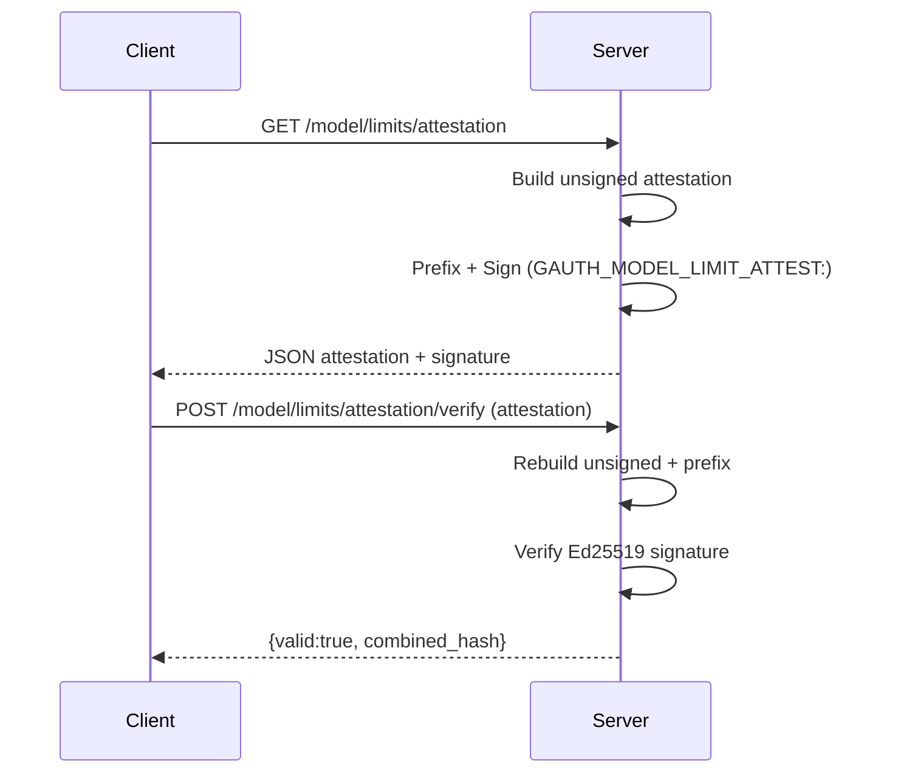
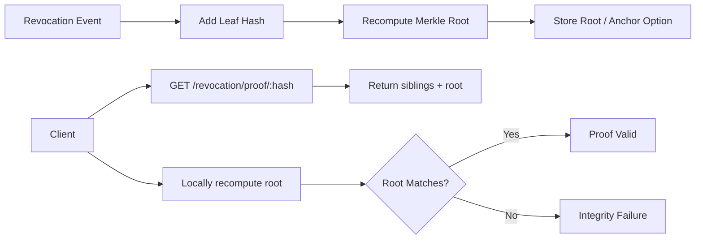
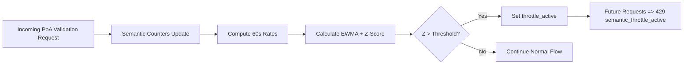

# Architecture & Flow Diagram Placeholders

These Mermaid placeholders outline key flows for the upcoming demo. Replace or refine with actual identifiers once final.

## 1. Rotation Summary Multi-Signature Flow
```mermaid
flowchart LR
    A[Start Rotation Event] --> B[Update Ledger Entry]
    B --> C[Compute Canonical Payload]
    C --> D[Collect Active Ed25519 Keys]
    D --> E[Sign Payload (each key)]
    E --> F[Aggregate Signatures + SatisfiedWeight]
    F --> G{Threshold Met?}
    G -- Yes --> H[Publish /api/v1/beta/rotations/summary]
    G -- No --> I[Error rotation_threshold_unsatisfied]
```

## 2. Model Limits Attestation & Verification


## 3. Revocation Merkle Inclusion Proof (Future Endpoint)


## 4. Semantic Anomaly Throttle Activation


## 5. PoA Lifecycle & Delegation
```mermaid
flowchart LR
    A[Issue PoA Definition] --> B[Assign Parties & Requirements]
    B --> C[Sign PoA (future multi-weight)]
    C --> D[Use PoA in Transaction]
    D --> E[Validate Scope & Requirements]
    E --> F{Valid?}
    F -- Yes --> G[Authorize Action]
    F -- No --> H[Reject + semantic counter]
    G --> I[Potential Revocation]
    I --> J[Update Revocation Chain]
```

---
Refinement Checklist:
- Add concrete hash examples once stable
- Show threshold math after weight remediation
- Insert replay nonce field in attestation diagram on implementation
- Add partial revocation / suspension states to PoA lifecycle when extended
