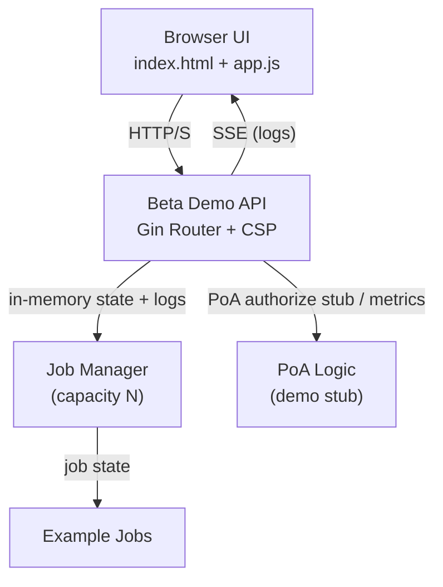

# Educational Demo

> Last Updated: 2025-10-17
> Status: Active

> ⚠️ **DEPRECATION NOTICE**: This document and its legacy "educational" endpoint paths are being migrated to the Beta demonstration terminology and `/api/v1/beta/*` endpoints. Use beta paths going forward; legacy paths remain temporarily for backward compatibility and will be removed in a future release.

## Architecture (Mermaid Diagram)


# Beta Demo Server & Examples API

> NOT PRODUCTION READY – This document explains the embedded beta demonstration server bundled with the repository. It is intentionally simplified, unauthenticated, and focused on illustrating concepts.

## Overview
The demo server (`cmd/web-server`) provides:
- Embedded single-page UI (`/index.html`) with zero external file dependencies (uses `go:embed`).
- Example execution API (catalog + job lifecycle).
- Server-Sent Events (SSE) log streaming for running example jobs.
- Minimal PoA authorization endpoint & metrics counter.
- Hardened (demo) Content Security Policy with per-request nonce.

## Launching
```bash
go run ./cmd/web-server            # defaults to :8080
GAUTH_WEB_PORT=9090 go run ./cmd/web-server
```
Visit `http://localhost:8080/index.html`.

## Endpoints Summary
| Method | Path | Purpose |
|--------|------|---------|
| GET | `/` | Minimal landing page (link to UI) |
| GET | `/index.html` | Full embedded UI |
| GET | `/static/css/style.css` | Embedded CSS asset |
| GET | `/static/js/app.js` | Embedded JS asset |
| GET | `/favicon.ico` | 1x1 GIF to suppress 404 noise |
| GET | `/api/v1/beta/health` | Health probe (primary) |
| GET | `/api/v1/beta/info` | Basic info / features |
| GET | `/api/v1/beta/examples/catalog` | List available examples |
| POST | `/api/v1/beta/examples/run` | Start example job (JSON: `{ "id": "<example_id>" }`) |
| GET | `/api/v1/beta/examples/run/:id/status` | Poll job state |
| GET | `/api/v1/beta/examples/run/:id/logs` | SSE log stream |
| POST | `/api/v1/beta/examples/run/jobs/:id/cancel` | Cancel a queued/running job |
| POST | `/api/v1/poa/authorize` | Demo Power-of-Attorney authorization stub |
| (Deprecated) | `/api/v1/educational/*` | Legacy paths – will be removed |
| GET | `/api/v1/poa/metrics` | Simple metrics (total PoA authorization attempts) |

## Architecture (Educational Server)

```
┌──────────────────────────┐           ┌──────────────────────┐
│        Browser UI        │  HTTP/S   │   Educational API    │
│  index.html + app.js     │◀────────▶│  Gin Router + CSP    │
└────────────┬─────────────┘           └─────────┬────────────┘
        │  SSE (logs)                        │
        ▼                                    │
      EventSource (SSE)                           │
        │                                    │
        ▼                                    ▼
   ┌──────────────┐      in‑memory      ┌──────────────┐
   │  Job Manager  │◀──────────────────▶│  Example Jobs │
   │  (capacity N) │   state + logs      └──────────────┘
   └──────────────┘
     │
     │ PoA authorize stub / metrics
     ▼
   ┌──────────────┐
   │  PoA Logic    │ (educational stub)
   └──────────────┘
```

Key flows:
1. UI requests catalog → API returns static list.
2. User starts example → job created (queued → running → done) with simulated work.
3. Browser opens SSE stream to receive incremental log events until terminal state.
4. PoA authorize endpoint increments metrics counter (demonstration only).


## Job Lifecycle
States: `queued` → `running` → (`done` | `failed` | `timeout`)

Each run returns a JSON structure:
```json
{
  "success": true,
  "job_id": "RNKaCX9C6pM=",
  "state": "queued"
}
```
After creation the server immediately transitions to `running` and begins appending log lines. A background goroutine simulates work and sets the job to `done` with an output description.

`GET /api/v1/educational/examples/run/<id>/status` returns:
```json
{
  "success": true,
  "job": {
    "id": "RNKa...",
    "example_id": "gauth_protocol_basics:minimal_poa",
    "state": "done",
    "output": "Example gauth_protocol_basics:minimal_poa completed",
    "error": "",
    "started_at": "2025-10-11T15:46:49.123Z",
    "finished_at": "2025-10-11T15:46:50.012Z"
  }
}
```

## Log Streaming (SSE)
See `docs/LOG_STREAMING.md` for full details. The implemented format currently streams incremental `log` events as they appear, followed by a terminal `done` event when the job reaches a final state.

Quick usage:
```bash
JOB_ID=$(curl -s -X POST -H 'Content-Type: application/json' \
  -d '{"id":"gauth_protocol_basics:minimal_poa"}' \
  http://localhost:8080/api/v1/educational/examples/run | jq -r .job_id)

curl -N http://localhost:8080/api/v1/educational/examples/run/$JOB_ID/logs
```

## Content Security Policy (CSP) & Nonces
A per-request random nonce strengthens the CSP:
```
Content-Security-Policy: 
  default-src 'self' https://cdn.jsdelivr.net https://cdnjs.cloudflare.com; 
  script-src 'self' 'nonce-<RANDOM>' https://cdn.jsdelivr.net https://cdnjs.cloudflare.com; 
  style-src 'self' 'unsafe-inline' https://cdn.jsdelivr.net https://cdnjs.cloudflare.com; 
  font-src 'self' https://cdnjs.cloudflare.com data:; 
  img-src 'self' data:; 
  connect-src 'self'; 
  frame-ancestors 'none'; 
  base-uri 'self'
```
Current UI does not yet inject the nonce into inline `<script>` tags (placeholder present for future enhancement); all embedded scripts are served from `/static/js/app.js` which is whitelisted by origin.

## Embedded Assets
All static assets are embedded via `go:embed` inside `web/server_clean.go`, enabling a single self-contained binary. Pros:
- Simple distribution
- No relative path issues
- Demonstrates Go's embedding feature

Cons (production perspective):
- Rebuild required for asset changes
- No cache-busting hash filenames yet

## Cancellation
`POST /api/v1/educational/examples/run/jobs/:id/cancel` sets a running or queued job state to `failed` with `error="cancelled"`. Already completed jobs are unchanged.

## Capacity & Retention
The in-memory `JobManager` stores recent jobs (capacity configured at construction; currently 200). Oldest jobs are evicted once capacity is exceeded.

## Educational Limitations
| Aspect | Simplification |
|--------|----------------|
| AuthN/AuthZ | None (all endpoints open) |
| Persistence | In-memory only |
| Logging | In-memory slice per job |
| Backpressure | None on SSE stream |
| Multi-tenancy | Not implemented |
| Error taxonomy | Minimal generic errors |

## Future Enhancement Ideas
- Incremental line-based streaming with ring buffer
- WebSocket mode for richer interaction
- Filtering & paging job list
- HTML nonce injection for inline bootstrap script
- Structured metrics (Prometheus exposition)
- Optional API key for write operations

---
*Educational implementation – contributions welcome. See README for global project disclaimers.*

---
Need context? See: README.md | docs/ARCHITECTURE.md | docs/GETTING_STARTED.md
