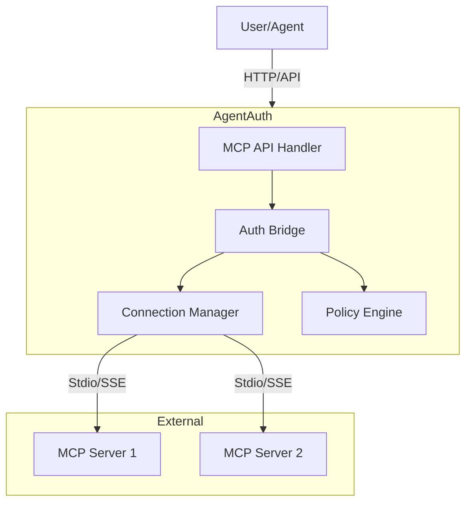

# AgentAuth MCP Integration Guide

## Overview
The Model Context Protocol (MCP) integration allows AgentAuth to connect to external AI-compatible resources (tools, prompts, data) and govern access to them using its policy engine. This guide details the architecture, configuration, and usage of the MCP subsystem.

## Architecture



### Key Components
1.  **Connection Manager**: Manages persistent connections to external MCP servers via Stdio or SSE transports.
2.  **Authorization Bridge**: Intercepts all Tool/Resource access requests and enforces AgentAuth policies (e.g., "Agent A can only call Tool B if verified").
3.  **Audit Logger**: Records all MCP interactions for compliance.

## Usage

### 1. Accessing the Dashboard
Navigate to `/dashboard/mcp` (e.g., `http://localhost:8080/dashboard/mcp`) to view the admin interface.

### 2. Registering a Server
You can register a server via the API or Dashboard.

**API Example:**
```bash
curl -X POST http://localhost:8080/api/v1/agentauth/mcp/servers \
  -H "Content-Type: application/json" \
  -d '{
    "name": "filesystem-server",
    "transport": "stdio",
    "command": "npx",
    "args": ["-y", "@modelcontextprotocol/server-filesystem", "/tmp"]
  }'
```

### 3. Using Tools
Agents can list and call tools via the proxy endpoints:

- **List Tools**: `GET /api/v1/agentauth/mcp/servers/{name}/tools`
- **Call Tool**: `POST /api/v1/agentauth/mcp/servers/{name}/tools/{toolName}/call`

## Security & Compliance
- **Transport Security**: Stdio is local-only. SSE supports HTTPS.
- **Authorization**: All calls are gated by the `GAuth-Token` logic. Ensure agents present valid JWTs mapping to allowed policies.
- **Audit**: Check `/api/v1/admin/audit` for logs of all tool executions.
