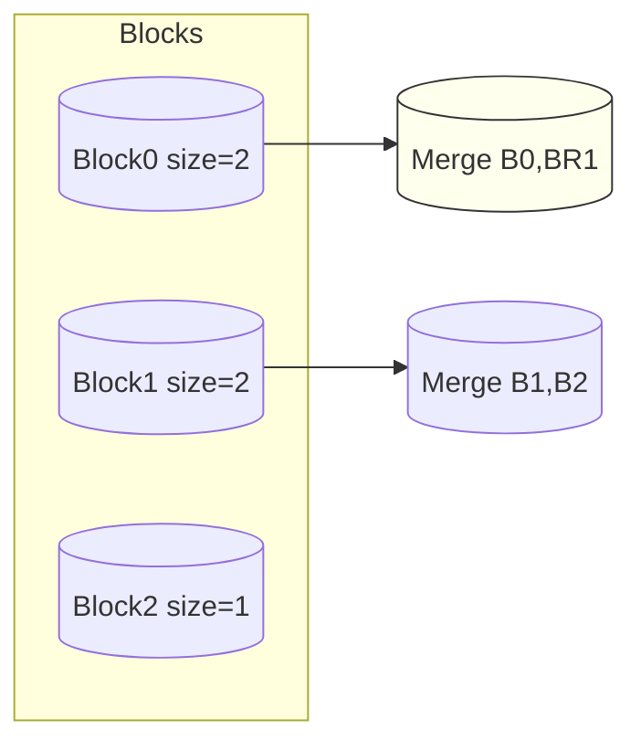
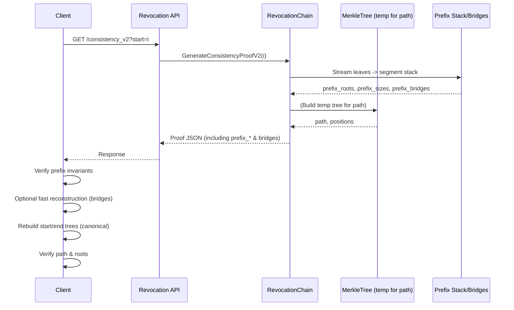
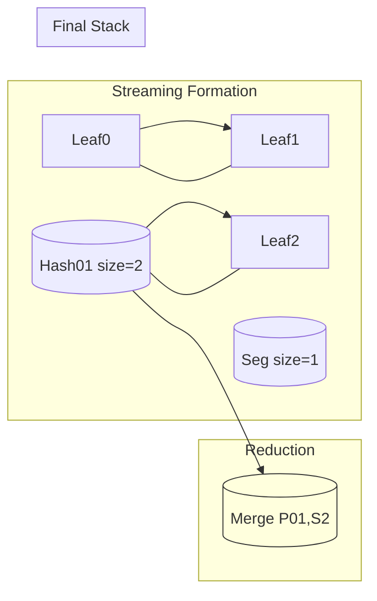
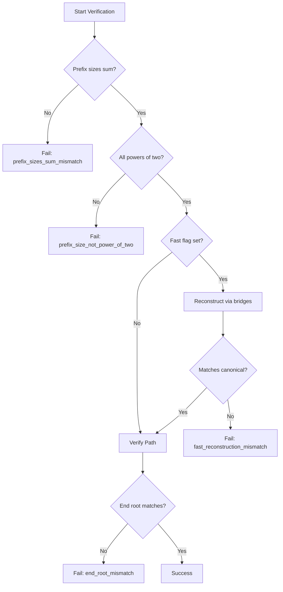
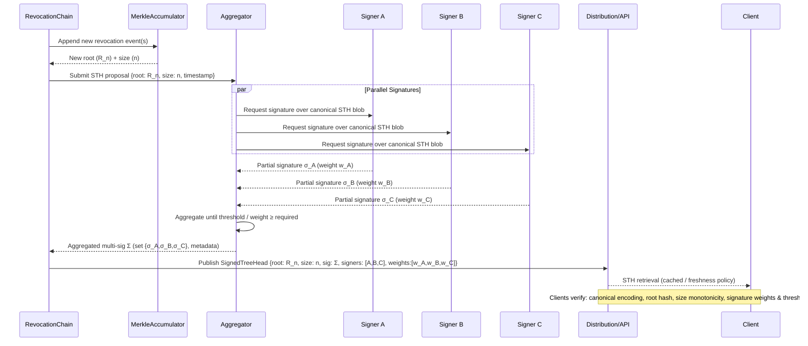

# Revocation Transparency (Merkle, Signed Tree Heads, Consistency & Multi-Sig)

> Status: Beta Demonstration – Not production hardened
> Last Updated: 2025-10-18

This document consolidates the integrity and verification surfaces for the revocation subsystem: hash-chained events, Merkle inclusion proofs, Signed Tree Heads (STH) with optional multi-signature thresholds and weights, persistence, and append-only consistency proofs.

## 1. Objectives
| Goal | Mechanism | Threat Mitigated |
|------|-----------|------------------|
| Event tamper detection | Hash chain (prev_hash + SHA-256) | Historical mutation / reordering |
| Efficient inclusion verification | Merkle tree over event hashes | O(n) linear scans / partial evidence absence |
| Snapshot authenticity | Signed Tree Heads (Ed25519 signatures) | MITM root substitution, forged state |
| Stronger trust / compromise tolerance | Multi-sig threshold & weights | Single key compromise, signer collusion below threshold |
| Append-only growth proof | Consistency proof (prototype) | History truncation / rebranch attacks |
| Crash/restart continuity | STH persistence file | Loss of provenance across restarts |

## 2. Data Structures
### 2.1 RevocationEvent (summary)
```
{
  id, delegation_id|delegation_hash, reason, revoked_at, prev_hash, hash,
  sig_kid?, signature?
}
```

### 2.2 Merkle Tree
- Leaves: `SHA256("AGENTAUTH_MERKLE_LEAF:" + eventHash)`
- Parent: `SHA256("AGENTAUTH_MERKLE_NODE:" + left + right)` (hex concatenation)
- Odd leaf promotion: last leaf copied upward without hashing partner (deterministic root)

Proof step: `{ sibling: <hex>, position: "L"|"R" }` where position denotes sibling relative to evolving hash.

### 2.3 Signed Tree Head
```
Version >=1:
{
  version, merkle_root, chain_length, aggregate_hash, timestamp,
  signatures: [{kid, alg=EdDSA, sig, weight?}],
  threshold?, weights_total?, satisfied_weight?
}
```
Version 2 adds `threshold` & `weights_total` to the signed payload binding multi-sig parameters.

### 2.4 Consistency Proof (Prototype)
```
{
  start_length, end_length, start_root, end_root,
  new_leaves: [<event_hashes_appended_after_start>]
}
```
Validation reconstructs Merkle trees for `start_length` and `end_length` and verifies appended slice matches `new_leaves`.

## 3. Signing & Multi-Sig
Environment variables:
| Variable | Description |
|----------|-------------|
| `AGENTAUTH_TOKEN_SIG_MODE=eddsa` | Enables Ed25519 signing of events & STHs |
| `AGENTAUTH_MULTI_SIG_THRESHOLD` | Required cumulative signature weight (or count) for STH validity (>1 activates multi-sig v2) |
| `AGENTAUTH_MULTI_SIG_WEIGHTS` | Comma list `kid=weight` for non-uniform signer weights |
| `AGENTAUTH_STH_PERSIST_PATH` | Path to JSON file storing STH history |

Weights semantics:
- If weights list empty: each signature weight = 1.
- If provided: signature entry receives configured weight (must be >0).
- STH considered valid when cumulative weights of included signatures ≥ `threshold`.

Security note: Threshold & total weights are part of version 2 signature payload; altering them requires resigning to remain valid.

## 4. Persistence
Setting `AGENTAUTH_STH_PERSIST_PATH` causes every new STH to be appended (overwriting full file with array) and reloaded on startup. Invalid signatures are skipped. If no valid STH remains, in-memory history is retained (defensive fallback).

File format (example):
```jsonc
[
  {
    "version":2,
    "merkle_root":"...",
    "chain_length":42,
    "aggregate_hash":"...",
    "timestamp":"2025-10-18T12:00:00Z",
    "threshold":5,
    "weights_total":7,
    "satisfied_weight":5,
    "signatures":[{"kid":"kA","alg":"EdDSA","sig":"...","weight":2},{"kid":"kC","alg":"EdDSA","sig":"...","weight":3}]
  }
]
```

## 5. Endpoints & Discovery
| Endpoint | Purpose | Notes |
|----------|---------|-------|
| `/api/v1/token/revocation/verify` | Chain event listing + global verification status | Includes per-event signature metadata |
| `/api/v1/token/revocation/root` | Current Merkle root + chain length | Empty root if no events |
| `/api/v1/token/revocation/proof` | Inclusion proof by `id`, `index`, or `hash` | Query params: one of `id`, `index`, `hash` required |
| `/api/v1/token/revocation/consistency?start=<i>` | Consistency proof between tree head `i` and latest | Prototype O(n) verification |
| `/.well-known/agentauth-configuration` | Discovery metadata | `revocation_support` object includes STH, threshold, satisfied_weight |
| `/.well-known/jwks.json` | Ed25519 public keys (OKP) | Used for client-side signature verification |

## 6. Verification Workflow (CLI `cmd/verify`)
1. Fetch discovery → extract latest STH.
2. Fetch event list → choose target hash (last or provided).
3. Fetch Merkle proof (`hash=<target_hash>`).
4. Compute leaf digest, verify inclusion against `merkle_root`.
5. Fetch JWKS, import public keys, verify STH signatures (multi-sig threshold).
6. If history size > 1: fetch consistency proof and verify append-only growth.

Run:
```bash
go run ./cmd/verify --base http://localhost:8080
```

Sample output:
```
[info] latest STH: version=2 root=... length=42 threshold=5 satisfied=5/7 signatures=2
[info] merkle inclusion verified=true root=... proof_steps=7
[info] tree head signatures verified
[info] consistency proof verified
[verify] SUCCESS all checks passed
```

## 7. Threat Model Tie-In
| Threat | Control | Residual Risk |
|--------|---------|---------------|
| Event history tampering | Hash chain + signature verification | Key compromise not externally witnessed |
| Selective omission | Merkle inclusion proofs (client can request arbitrary events) | Need audit counters for proof failures |
| Root substitution | STH multi-sig threshold + public JWKS | Insufficient signer diversity / stale key rotation |
| Fork / rollback | Consistency proof (history growth) | Prototype proof is O(n); attacker with large chain might degrade performance |
| Key compromise (single) | Threshold >1 with weights | Collusion above threshold still possible |

## 8. Performance Baselines (Representative)
| Operation | Approx Latency (ns or ms) | Notes |
|-----------|---------------------------|-------|
| Merkle append | ~250 ns/op | Per event hash append |
| Proof generation | ~230 ns/op | O(log n) traversal |
| Sign STH (multi-sig) | ~2.4 ms/op | Includes payload marshal + Ed25519 signatures |
| Consistency proof gen | ~2.7 µs/op | Linear slice of new events |

Benchmarks located in `pkg/delegation/benchmark_test.go`.

### Consistency Proof V2 Generation Optimization (2025-10-20)
Recent changes introduce a streaming prefix decomposition and fast reconstruction path:
([Performance Guide Section](PERFORMANCE.md#revocation-consistency-proof-v2-optimization-2025-10-20))
| Aspect | Previous | Current |
|--------|----------|---------|
| Prefix decomposition | Full level rebuild (O(n) memory) | Streaming segment stack (≤ log2(n) segments) |
| Start root reconstruction | Always full Merkle rebuild | Optional fast reduction via `prefix_bridges` |
| Consistency path generation | Full tree traversal | Still full traversal (next optimization phase) |
| Allocations (4096 leaves) | ~7.70MB / 77,894 allocs | ~4.77MB / 49,194 allocs |

Benchmark excerpt (Apple M3 Pro):
| Leaves | New Gen ns/op | Legacy Gen ns/op |
|--------|---------------|------------------|
| 64     | 32,494        | 51,828           |
| 256    | 129,732       | 203,742          |
| 1024   | 530,838       | 837,270          |
| 4096   | 2,217,502     | 3,548,736        |
Source: `BenchmarkConsistencyProofGeneration` (benchtime=0.2s). Re-run for updated figures.

Additional proof fields:
| Field | Purpose |
|-------|---------|
| `prefix_roots` | Power-of-two block subtree roots covering first `start_length` leaves (left→right) |
| `prefix_sizes` | Sizes of corresponding blocks (each a power of two; sum = `start_length`) |
| `prefix_bridges` | Intermediate merged digests from right-to-left reduction enabling fast reconstruction |

Fast Reconstruction:
If `AGENTAUTH_CONSISTENCY_V2_FAST=1`, verification attempts to reduce blocks using bridges; mismatch vs canonical rebuild aborts with `fast_reconstruction_mismatch`. Complexity: `O(b)` where `b = len(prefix_roots)` ≤ `log2(start_length)+1`.

Verification Invariants:
1. All `prefix_sizes[i]` are powers of two.
2. Sum(`prefix_sizes`) == `start_length`.
3. Each `prefix_roots[i]` matches canonical subtree root at its offset.
4. Fast reconstructed root (when attempted) equals full rebuild root.

Planned Next Phase:
* Replace path generation temporary tree with interval-based sibling derivation (pure streaming / frontier state).
* Memoize range hashes during segment formation for reuse in path algorithm.
* Add auditor metrics for allocation deltas and GC pause comparisons.

Benchmark Command:
```bash
go test -run=NONE -bench=BenchmarkConsistencyProofGeneration -benchmem ./pkg/delegation
```
Single size (e.g., 1024 leaves):
```bash
go test -run=NONE -bench=BenchmarkConsistencyProofGeneration/new_gen_1024 -benchmem ./pkg/delegation
```

Troubleshooting:
| Symptom | Likely Cause | Resolution |
|---------|--------------|------------|
| `fast_reconstruction_mismatch` | Bridge sequence or hashing domain altered | Verify merge order & domain prefixes; rebuild bridges |
| Elevated allocs | Slice growth / missed pooling | Profile with `-benchmem`; pool segment stack |
| Path length over bound | Incorrect convergence logic | Review parity checks in traversal loop |

Security Notes:
Fast path always cross-checks canonical root; it cannot silently substitute a forged root. Bridges disclose only merge lineage of already inferable subtree hashes.

#### Diagram: Block & Bridge Reduction

`prefix_roots` => `[B0,B1,B2]`; `prefix_bridges` => `[BR1,BR2]` → reconstructed `start_root=BR2`.

#### Glossary (Consistency Proof V2)
| Term | Definition | Notes |
|------|------------|-------|
| `segment stack` | Streaming merge structure producing power-of-two blocks | Basis for `prefix_roots` |
| `prefix_roots` | Subtree roots of maximal power-of-two blocks covering historical prefix | Left→right order |
| `prefix_sizes` | Block sizes in leaves (powers of two) | Sum = `start_length` |
| `prefix_bridges` | Merge lineage digests enabling fast start root reconstruction | Right-to-left reduction |
| `fast reconstruction` | Replay of bridges reducing multi-block prefix to single root | Cross-checked vs canonical rebuild |
| `temporary tree` | Full Merkle structure used for logarithmic path currently | Will be replaced by streaming path |
| `interval-based path` | Planned path derivation using frontier intervals (no full tree) | Future upgrade |
| `frontier` | Set of current highest subtree roots after merges | Candidate cache for path optimization |

## 9. Roadmap
| Area | Planned Enhancement |
|------|---------------------|
| Consistency Proofs | RFC6962 logarithmic proofs (auditability at scale) |
| External Anchoring | Periodic STH + aggregate hash anchoring (e.g., Sigstore, blockchain) |
| Audit Coupling | Emit audit entry per STH + verification attempts |
| Proof Caching | Memoize frequent proofs; add metrics |
| SLA Metrics | Prometheus counters for signature failures, proof verifications, latency histograms |
| Client Library | Reusable Go module & language-specific ports |
| Root Witness | Gossip-based root witness quorum & signed witness receipts |
| Rotation Continuity | Public key history publication + revocation of signing keys |

## 10. Security Caveats (Demo Scope)
- Persistence file unencrypted (no at-rest protection).
- No external timestamping or anchored witness set.
- Multi-sig configuration via environment variables (no signed policy of threshold or weights).
- Consistency proof not optimized for large chains.
- No denial-of-service mitigation on proof endpoints (rate limiting advisable for production).

## 11. Implementation References
| File | Responsibility |
|------|---------------|
| `pkg/delegation/revocation_chain.go` | Event append, Merkle integration, STH signing, multi-sig verify, persistence |
| `pkg/delegation/merkle.go` | Merkle tree construction & proof verification |
| `web/server_clean.go` | HTTP endpoints & discovery metadata publication |
| `cmd/verify/verify.go` | End-user verification workflow |
| `internal/crypto/keys.go` | Ed25519 key manager + public key import |
| `pkg/delegation/treehead_multisig_test.go` | Multi-sig verification tests |
| `pkg/delegation/treehead_persist_test.go` | Persistence tests |
| `pkg/delegation/benchmark_test.go` | Performance benchmarks |

## 12. Quick API Reference Snippets
### Inclusion Proof Request
```
curl -s "http://localhost:8080/api/v1/token/revocation/proof?hash=<event_hash>" | jq
```
### Consistency Proof Request
```
curl -s "http://localhost:8080/api/v1/token/revocation/consistency?start=0" | jq
```
### Discovery STH Metadata
```
curl -s "http://localhost:8080/.well-known/agentauth-configuration" | jq '.revocation_support.sth_latest'
```

## 13. Verification Pseudocode
```go
sth := fetchDiscovery().RevocationSupport.STHLatest
events := fetchVerify().Events
hash := chooseTarget(events)
proof := fetchProof(hash)
if !VerifyProof(LeafDigestForEventHash(hash), proof.Steps, proof.Root) { fail("inclusion") }
keys := fetchJWKS()
km := NewEphemeralManager(); importEdDSAPublic(keys, km)
if err := VerifyTreeHeadMultiSig(sth); err != nil { fail("signature") }
if historySize > 1 { cons := fetchConsistency(0); VerifyConsistencyProof(cons, events) }
SUCCESS
```

---
*For development considerations see also:* `POLICY_ENGINE.md` (integration section), `CRYPTOGRAPHY_IMPLEMENTATION.md`, `OBSERVABILITY.md`.

## 16. Architecture Diagrams (Revocation Transparency)

### 16.1 Component Overview
```mermaid
graph TD
  A[Client] -->|Fetch Events| B[Revocation API]
  A -->|Fetch Inclusion Proof| B
  A -->|Fetch Consistency Proof V2| B
  A -->|Fetch Discovery & JWKS| B
  B --> C[RevocationChain]
  C --> D[MerkleTree]
  C --> E[STH Signer (Ed25519)]
  C --> F[Persistence File]
  E --> G[Key Manager]
  G --> H[Key Material / Weights]
  C --> I[Auditor Endpoint]
  I --> J[Metrics Export]
  subgraph Proof Generation
    D
    C
  end
  subgraph Verification Client Side
    A
  end
```

### 16.2 Consistency Proof V2 Data Flow


### 16.3 Prefix Reduction Internals


### 16.4 Verification Decision Points


### 16.5 Cross-Reference
- Performance metrics & benchmarks: see [`PERFORMANCE.md#revocation-consistency-proof-v2-optimization-2025-10-20`](PERFORMANCE.md#revocation-consistency-proof-v2-optimization-2025-10-20)
- Cryptographic primitives: `CRYPTOGRAPHY_IMPLEMENTATION.md`
- Multi-sig weight semantics: Section 3 above & `ARCHITECTURE.md`

### 16.6 Multi-Sig Signed Tree Head Issuance Lifecycle


### 16.7 Minimal ConsistencyProofV2 Example
-### 16.8 Interval Path Optimization (Experimental)

When `AGENTAUTH_CONSISTENCY_V2_INTERVAL_PATH=1` the proof generator bypasses building a full temporary Merkle level cache. Instead it:
1. Streams leaf-domain digests into an internal helper for range hashing.
2. Uses the least-significant set bit (LSB) of `oldSize` to identify the largest aligned block ending at `oldSize`.
3. Hashes the adjacent sibling block if wholly contained in `EndLength`.
4. Appends its digest to the audit `path` with position `"R"` and advances `oldSize`.
5. Repeats until the start tree span reaches `EndLength`.

Constraints:
- Maintains append-only proof semantics (never rewinds beyond oldSize).
- Emits only right-position siblings in prototype; left-sibling scenarios (oldSize odd) will be folded in fuller implementation.
- Falls back automatically to legacy traversal when flag disabled.

Next Steps:
- Extend algorithm to handle mixed left/right sibling emission for non-aligned intervals.
- Integrate fast path verification (avoid full start/end tree rebuild).
- Populate performance table in `PERFORMANCE.md` with empirical measurements.


```json
{
  "start_size": 64,
  "end_size": 72,
  "start_root": "b6e3...d1",        
  "end_root": "9ac4...77",          
  "prefix_roots": ["a1b2...", "c3d4..."],
  "prefix_sizes": [32, 32],
  "prefix_bridges": ["f0aa...", "3be9..."],
  "path": ["7ae1...", "91ff...", "004c..."],
  "positions": [1, 0, 1],
  "hash_algo": "SHA-256",
  "version": 2
}
```
Field notes:
- `prefix_roots` / `prefix_sizes` enumerate the power-of-two blocks strictly covering `[0, start_size)`.
- `prefix_bridges` supply intermediate hashes enabling fast reconstruction of `start_root` from the prefix blocks (optional fast path).
- `path` / `positions` provide the sibling chain from the leaf range `[start_size, end_size)` necessary to derive `end_root` from `start_root`.
- All arrays are ordered from lowest index / earliest block upward.
- Truncated hex shown; canonical encoding is lowercase hex without separators.

### 16.9 Empty Chain Behavior (Updated 2025-10-20)
Prior to this update, calling `SignTreeHead()` on an empty revocation chain produced a "size=0" SignedTreeHead entry. This was noisy and enabled callback paths to attempt tree head publication before any revocation events existed. The implementation now returns `(nil, nil)` when `len(events)==0`.

Implications:
* No SignedTreeHead objects exist until the first revocation event is appended.
* API responses that include `latest_tree_head` will omit it (or present `null`) until at least one event has been recorded and a head signed.
* Callers must check for `nil` when invoking programmatic APIs (e.g., auto-rotation callbacks) and simply skip anchoring / distribution when absent.
* Monitoring should treat absence of an STH on an empty chain as informational, not an error.

Client Guidance:
```go
sth, err := rc.SignTreeHead()
if err != nil { /* handle error */ }
if sth == nil { /* no events yet; nothing to publish */ }
```

This change eliminates spurious panic logs observed when global rotation callbacks raced with freshly constructed empty chains in test environments.


## 14. Programmatic Verification (pkg/verification)
Instead of duplicating HTTP + cryptographic logic, consumers can import the reusable library:

```go
import (
  "net/http"
  "github.com/agentauth/AAP-RFC-0150-Go-Implementation-of-AgentAuth-1.0/pkg/verification"
)

func verify(base string, targetHash string) error {
  client := &http.Client{}
  return verification.VerifyAll(client, base, targetHash)
}
```

Granular functions are also exposed:
- `FetchDiscovery(client, base)`
- `FetchEvents(client, base)`
- `FetchProofByHash(client, base, hash)`
- `LoadJWKS(client, base)` (imports Ed25519 public keys)
- `ConvertSignedTreeHead(sthJSON)`
- `VerifyInclusion(eventHash, proof)`
- `VerifySTHMultiSig(sth)`
- `FetchConsistency(client, base, start)` + `VerifyConsistency(consistency, allEventHashes)`

Failure modes surfaced as errors (examples): `no_events`, `proof: http 404`, `inclusion_failed`, `sth_verify: threshold_not_met`.
The CLI `cmd/verify` now delegates entirely to this package for maintainability.

## 15. Verification Error Codes & Meanings
Below are the principal error strings surfaced by `pkg/verification` (either as direct errors or wrapped with prefixes like `sth_verify:`). They are intentionally plain for easy pattern matching; future versions may formalize structured codes.

| Error Fragment | Context | Meaning / Remediation |
|----------------|---------|-----------------------|
| `no_events` | Initial chain fetch | Revocation chain empty – nothing to verify (not an integrity failure) |
| `proof endpoint failure` | Inclusion proof fetch | Server returned `success=false` for requested hash/id/index – likely nonexistent event or wrong hash supplied |
| `inclusion_failed` | Merkle inclusion verification | Computed root from proof steps did not match advertised `merkle_root`; indicates tampering or mismatch |
| `sth_verify: threshold_not_met` | Multi-sig verification | Collected signatures' cumulative weight/count below declared threshold; STH invalid until sufficient signers included |
| `sth_verify: signature_invalid_<i>` | Multi-sig verification | Signature at position `<i>` failed Ed25519 validation (possibly altered payload, wrong key, or key rotation mismatch) |
| `sth_verify: unknown_kid` | JWKS import / verification | STH references a key id not present in published JWKS; server misconfiguration or attacker substituting kid |
| `nil_consistency` | Consistency fetch/verification | Consistency response lacked proof object; endpoint failure or unexpected shape |
| `new_leaves_mismatch` | Consistency verification | Provided `new_leaves` slice does not match expected appended event hash sequence; possible rollback/fork attempt |
| `start_root_mismatch` | Consistency verification | Reconstructed Merkle root for start length does not match claimed `start_root` – indicates history alteration |
| `end_root_mismatch` | Consistency verification | Reconstructed Merkle root for end length differs from claimed `end_root` – indicates inconsistency at tip |
| `nil_proof` | Inclusion verification | Proof object missing or nil – client should refetch or server bug |
| `signature_invalid` | General signature path | Non-specific signature failure (legacy single-sig path) |
| `threshold_not_met` | Direct from delegation package | Weight/count insufficient outside wrapped context |

Detection & Response Guidance:
* Inclusion / consistency mismatches: trigger alert, retain failing proof artifacts for forensic audit.
* Unknown kid: fetch JWKS again; if persistent, investigate key rotation announcements or potential spoofing.
* Threshold not met: wait for additional signer propagation; ensure environment variables for weights & threshold are correct and consistent across signers.
* Signature invalid: compare payload canonicalization logic; verify timestamp formatting (RFC3339) and absence of mutation post-signature.

Instrumentation Roadmap:
* Map each error fragment to Prometheus counter labels (`verification_failures_total{type="inclusion_failed"}` etc.).
* Structured JSON error export with `code`,`component`,`detail` fields for automated clients.
* Optional audit log emission for first occurrence of each unique failure per runtime session.

Client Matching Tips:
```go
if err != nil {
  switch {
  case strings.Contains(err.Error(), "inclusion_failed"):
    // handle inclusion integrity failure
  case strings.Contains(err.Error(), "threshold_not_met"):
    // wait/retry later
  case strings.Contains(err.Error(), "signature_invalid"):
    // alert signer set discrepancy
  }
}
```

These error strings are stable for the current beta phase; breaking changes (renames) will be listed in `CHANGELOG.md`.
