## Protocol & Diagnostics Diagrams

### Revocation Inclusion Flow
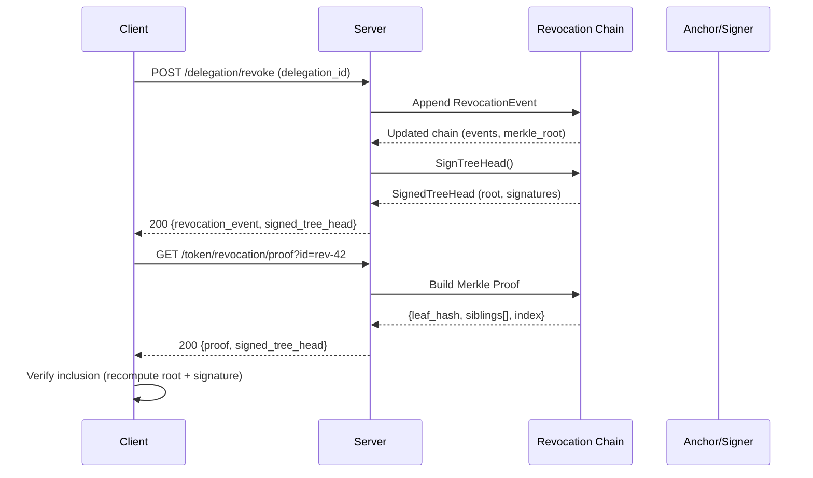

### Capability & Rotation Anchoring
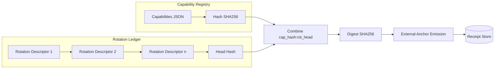

### Semantic Diagnostics Feedback Loop
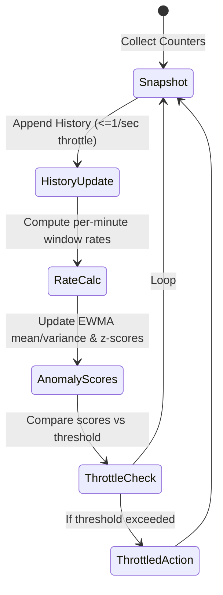

### Attestation Verification Path
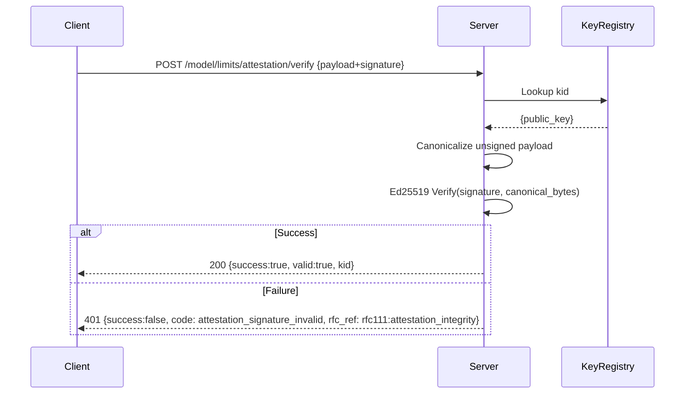

### Rotation Summary Invariants
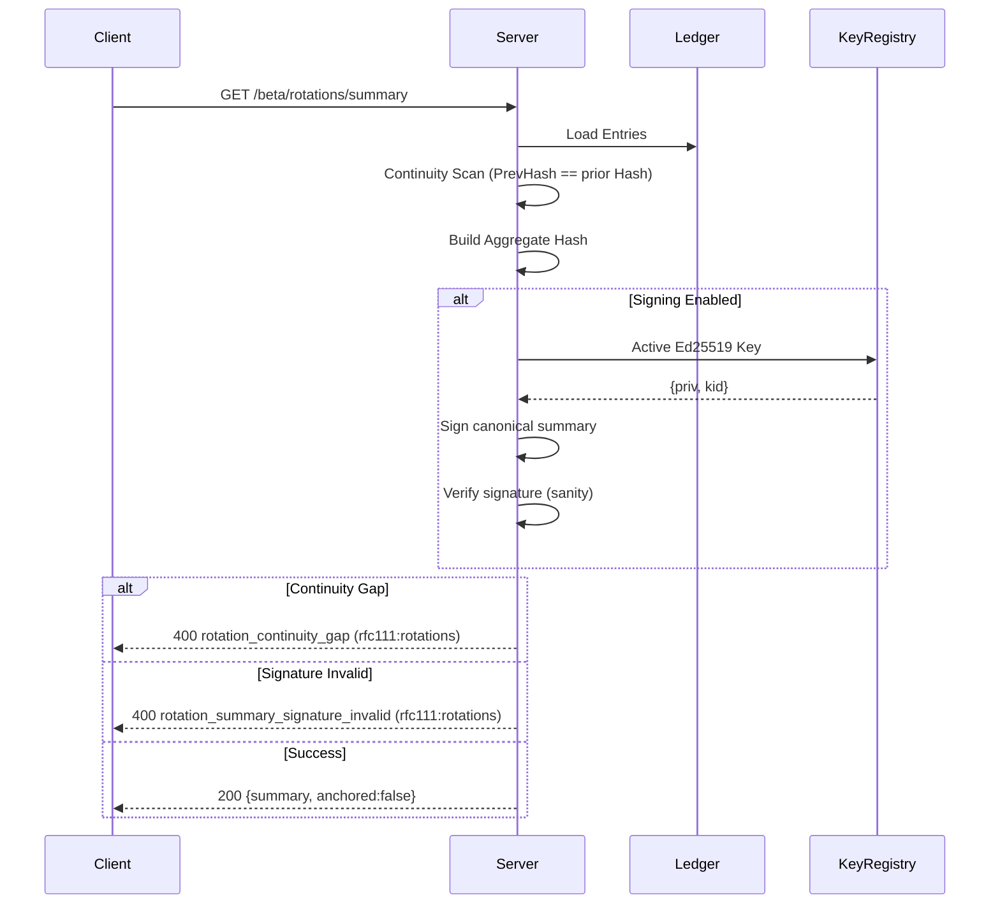

### Legend
- rfc111:* indicates governance & integrity related clauses.
- rfc115:* indicates semantic diagnostics & reactive controls.
- EdDSA signatures domain separated (GAUTH_ROTATION_SUMMARY:, GAUTH_ROTATION_DESCRIPTOR:).

### Future Extensions
- Inclusion proof: add optional batch verification endpoint.
- Multi-signature rotation summaries (threshold >1).
- External transparency log publishing for revocation & rotation roots.
# GAuth Mermaid Diagrams

## Token Issuance Flow
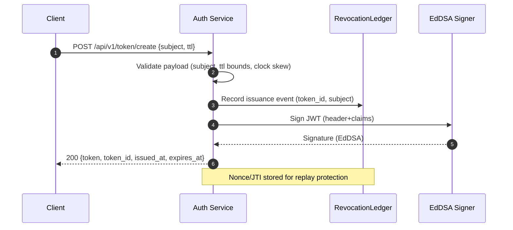

## Multi-Sig Aggregated BLS Signature (Issue Mode)
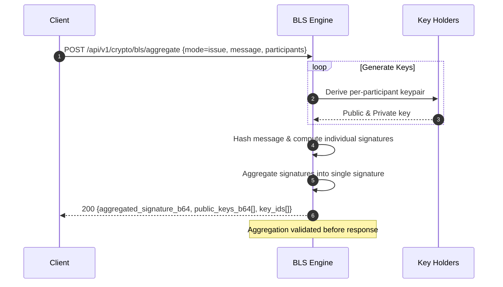

## BLS Proof-of-Possession Challenge & Verify
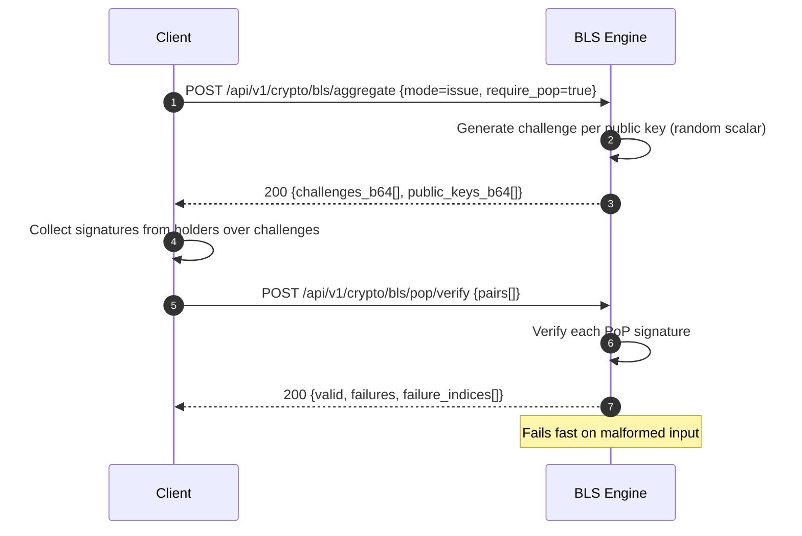

## Revocation Anchoring (Merkle Root Emit)
```mermaid
sequenceDiagram
    autonumber
    participant Client
    participant RevChain as RevocationChain
    participant Anchor as External AnchorClient
    Client->>RevChain: (implicit) Previously issued/revoked events update Merkle root
    Client->>Anchor: POST /api/v1/anchor/revocation/emit
    Anchor->>RevChain: Read current MerkleRoot()
    alt Chain Empty
        Anchor-->>Client: 404 revocation_chain_empty
    else Valid Root
        Anchor->>Anchor: Idempotent anchor(root)
        Anchor-->>Client: 200 {hash, merkle_root, chain_length}
    end
    Note over Anchor,RevChain: Receipt stored; total anchors incremented
```

## Semantic Diagnostics Snapshot
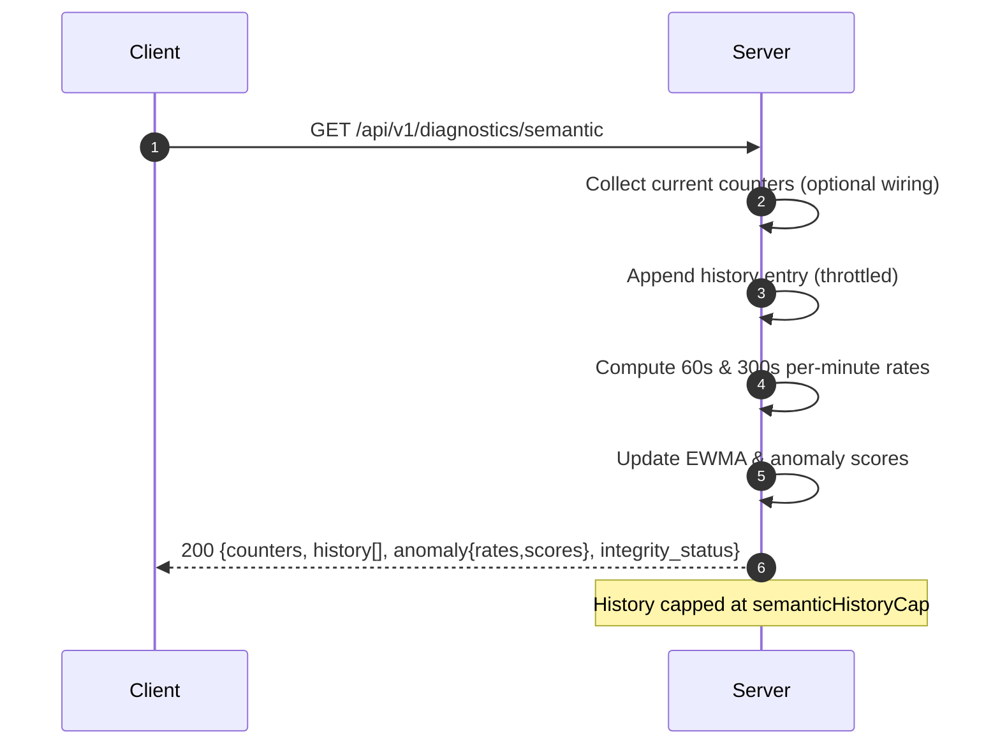

## Delegation (POA) Authorization Overview
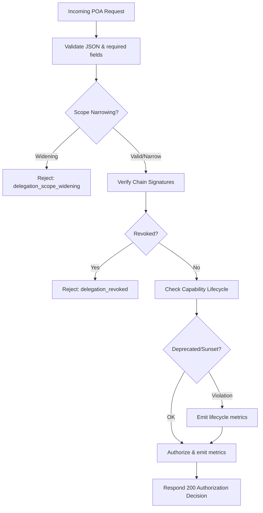

---
Generated diagrams reflect current endpoint & error taxonomy conventions (codes like revocation_chain_empty, delegation_scope_widening). Update as flows evolve.

## GNAP Resource Server Connection (RFC 9767)
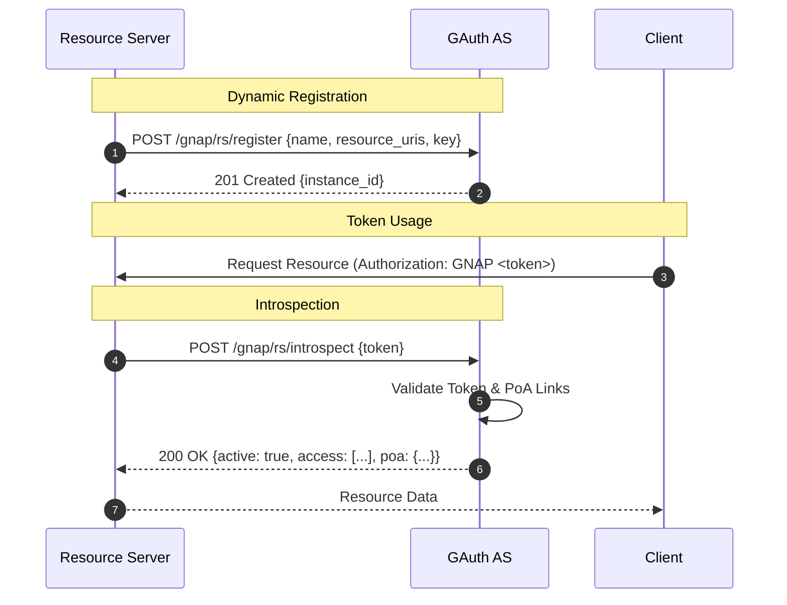

## OAuth 2.0 CIBA Flow
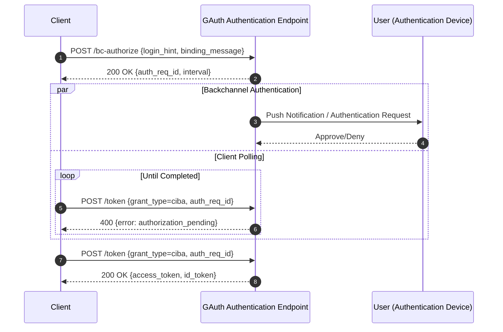

## SAML 2.0 & SCIM 2.0 Architecture
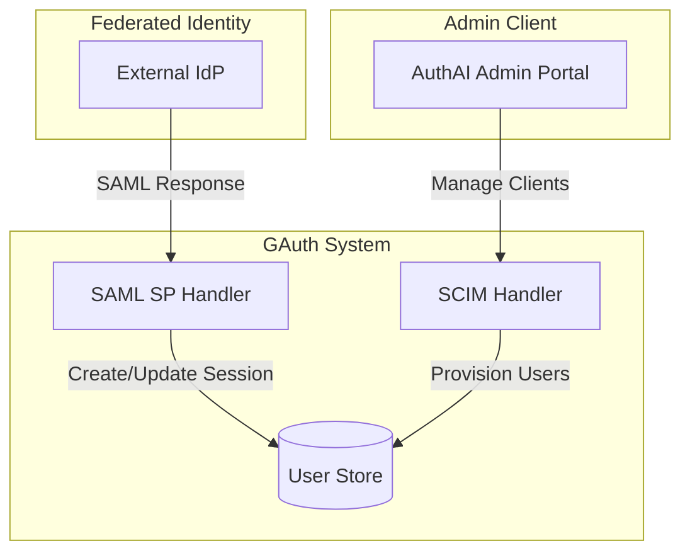
