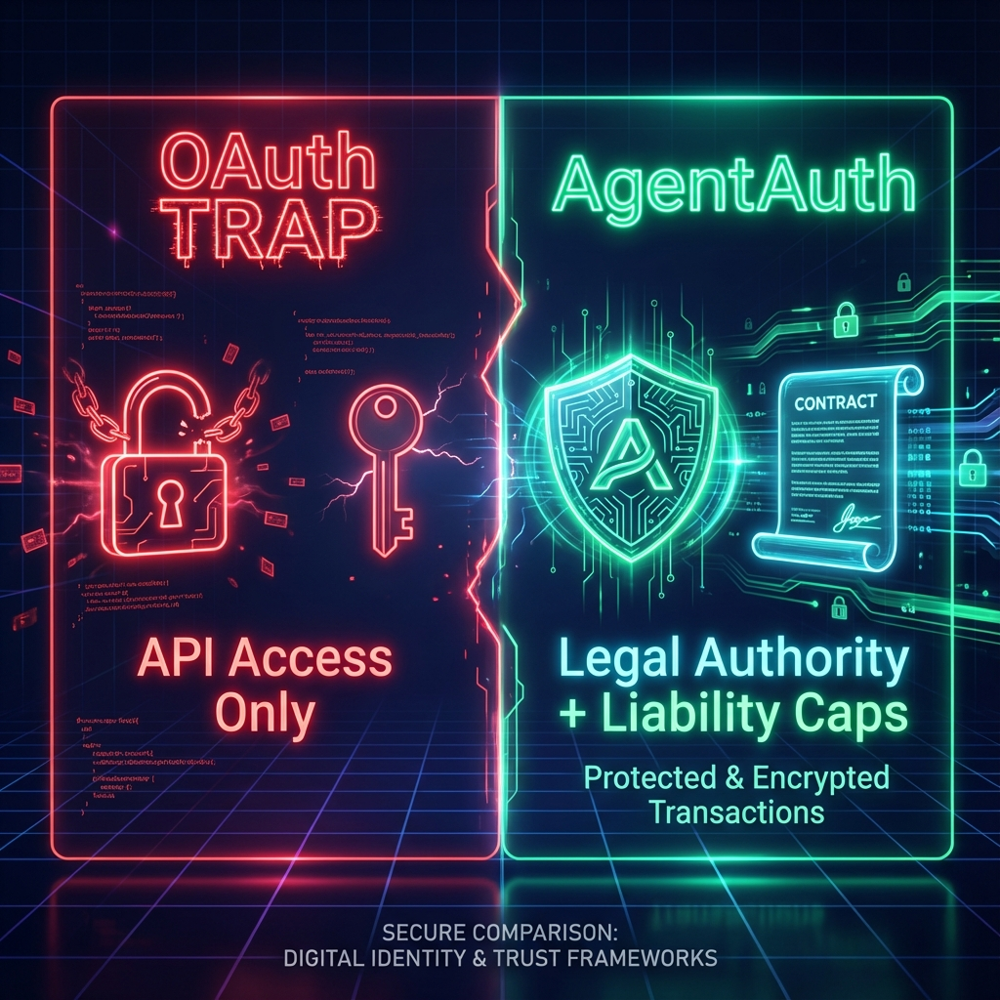
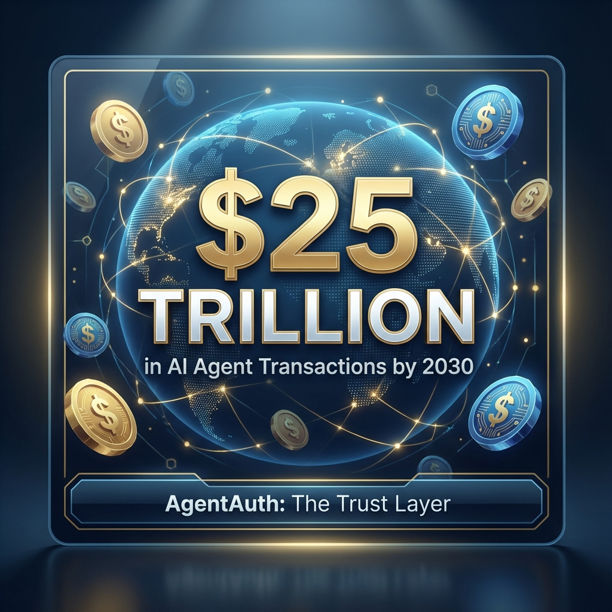

# Marketing Assets Gallery

This document collects the high-fidelity visual assets generated for the AgentAuth launch campaign.

## Social Media Visuals

### 1. The OAuth Trap Comparison
**File**: `images/oauth_vs_agentauth.png`
**Use Case**: Twitter Thread 1, LinkedIn Post 1 (Launch Announcement).
**Purpose**: Visually demonstrate the security gap between standard OAuth (Access only) and AgentAuth (Legal Authority). The neon "Trap" vs "Shield" design emphasizes safety.

### 2. $25 Trillion Economy Stat Card
**File**: `images/agentauth_stat_card_25t.png`
**Use Case**: Instagram Stat Card, Pitch Decks.
**Purpose**: High-impact financial hook to capture investor and executive attention. Highlights the massive market opportunity and the urgent need for infrastructure upgrades.

