# The Agent's Signature
## Identity, Authorization & Law in the Age of Autonomous AI

**A Comprehensive Technical & Legal Framework**

**By Mauricio A. Fernandez Fernandez**

---

> *"In the age of autonomous agents, every transaction is a legal act, every algorithm a potential fiduciary, and every cryptographic signature carries the weight of centuries of contract law."*

---

# Preface: Why This Book Matters Now

The year is 2025. Every major technology company has deployed thousands of AI agents handling customer service, code generation, supply chain optimization, and financial transactions. Yet a fundamental question remains unanswered:

**When an AI agent signs a contract, who is liable?**

This isn't a hypothetical. Bloomberg estimates that over $4 trillion in transactions are now initiated by autonomous systems annually. McKinsey projects this will reach $25 trillion by 2030. Yet our authorization infrastructure—OAuth 2.0, originally designed for "Login with Google" buttons—was never built for agents that act, not just access.

This book provides the definitive technical and legal framework for building **trustworthy autonomous agents**. It is based on the **AgentAuth** open-source implementation (v1.0.0, December 2025), which implements the AAP-001 and AAP-002 protocols.

---

# Part I: Foundations

---

# Chapter 1: The OAuth Trap — Why Access Tokens Aren't Enough

## 1.1 The Fundamental Distinction: Access vs. Authority

Every digital system today operates on a simple premise: **authenticate** the user, then **authorize** their actions. OAuth 2.0 perfected this model for web applications. But it has a fatal flaw.

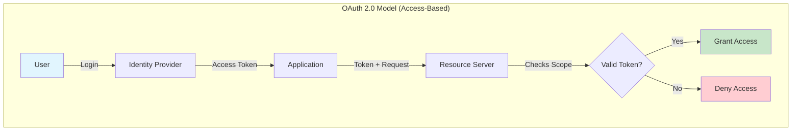
```mermaid
graph TD
    subgraph "OAuth 2.0 Model (Access-Based)"
        A[User] -->|Login| B[Identity Provider]
        B -->|Access Token| C[Application]
        C -->|Token + Request| D[Resource Server]
        D -->|Checks Scope| E{Valid Token?}
        E -->|Yes| F[Grant Access]
        E -->|No| G[Deny Access]
    end
    
    style A fill:#e1f5fe
    style F fill:#c8e6c9
    style G fill:#ffcdd2
```

**Figure 1.1: The OAuth 2.0 access model — simple, effective, but legally blind**

This model answers: *"Can this entity access this resource?"*

It does **not** answer:
- *"Is this entity legally empowered to bind its principal?"*
- *"Does this action fall within fiduciary duties?"*
- *"Who is liable if this transaction goes wrong?"*

Consider the legal distinction:

| Concept | Technical Analog | Legal Implication |
|---------|-----------------|-------------------|
| **Access Token** | House key | Can unlock door; no authority to sell house |
| **Delegation Token** | Power of Attorney | Can act on behalf of principal; legally binding |
| **PoA Token** | Notarized Limited Power of Attorney | Cryptographically verifiable; scope-limited; auditable |

---

## 1.2 Real-World Failure Modes

### Case Study 1: The Autonomous Procurement Agent

A manufacturing company deploys an AI agent to handle routine procurement. The agent has an OAuth token with `procurement:write` scope.

**Incident**: The agent identifies a 40% price reduction on specialty chemicals from a supplier in Belarus (sanctioned jurisdiction). It executes the $2.3M purchase order.

**Technical Authorization**: ✅ Valid token, valid scope
**Legal Authorization**: ❌ Violated OFAC sanctions
**Outcome**: $18M fine, criminal investigation

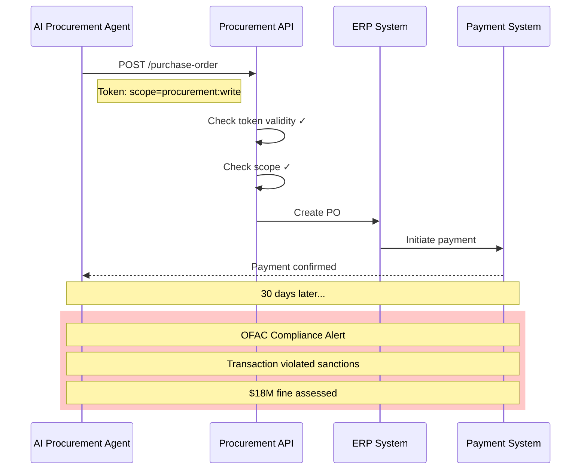
```mermaid
sequenceDiagram
    participant Agent as AI Procurement Agent
    participant API as Procurement API
    participant ERP as ERP System
    participant Bank as Payment System
    
    Agent->>API: POST /purchase-order
    Note right of Agent: Token: scope=procurement:write
    API->>API: Check token validity ✓
    API->>API: Check scope ✓
    API->>ERP: Create PO #23847
    ERP->>Bank: Initiate payment
    Bank-->>Agent: Payment confirmed
    
    Note over Agent,Bank: 30 days later...
    
    rect rgb(255, 200, 200)
        Note over Agent,Bank: OFAC Compliance Alert
        Note over Agent,Bank: Transaction violated sanctions
        Note over Agent,Bank: $18M fine assessed
    end
```

**Figure 1.2: OAuth authorization succeeds; legal authorization fails catastrophically**

### Case Study 2: The Healthcare AI Advocate

An elderly patient designates an AI agent as their healthcare advocate. The agent has OAuth access to their medical records.

**Incident**: Patient becomes incapacitated. Agent approves experimental surgery.

**Technical Authorization**: ✅ Valid API access
**Legal Authorization**: ❓ No valid healthcare proxy on file
**Outcome**: Surgery performed without legal consent; hospital faces liability

---

## 1.3 The Solution: Proof of Authorization (PoA)

AgentAuth introduces a new primitive: the **Proof of Authorization Token (PoA)**. Unlike an access token, a PoA carries:

1. **Principal Identity**: Cryptographically verified human/organizational identity
2. **Agent Identity**: Cryptographically bound software identity
3. **Scope Constraints**: What the agent can and cannot do
4. **Liability Limits**: Maximum financial exposure
5. **Jurisdictional Binding**: Applicable law
6. **Revocation Path**: How authority can be terminated

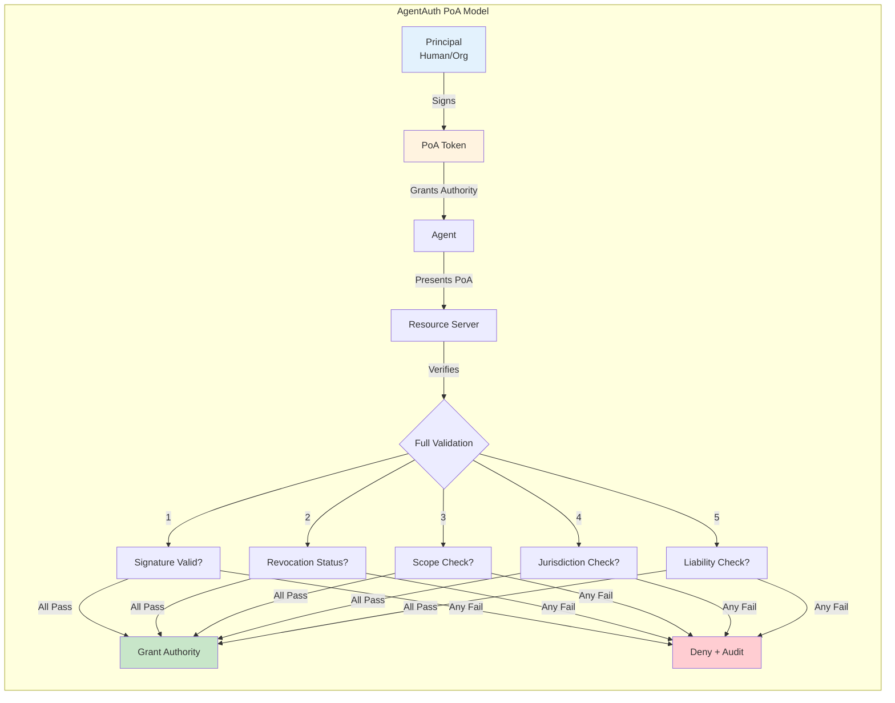
```mermaid
graph LR
    subgraph "AgentAuth PoA Model"
        P[Principal<br/>Human/Org] -->|Signs| POA[PoA Token]
        POA -->|Grants Authority| A[Agent]
        A -->|Presents PoA| RS[Resource Server]
        RS -->|Verifies| V{Full Validation}
        V -->|1| S[Signature Valid?]
        V -->|2| R[Revocation Status?]
        V -->|3| SC[Scope Check?]
        V -->|4| J[Jurisdiction Check?]
        V -->|5| L[Liability Check?]
        S & R & SC & J & L -->|All Pass| GRANT[Grant Authority]
        S & R & SC & J & L -->|Any Fail| DENY[Deny + Audit]
    end
    
    style P fill:#e3f2fd
    style POA fill:#fff3e0
    style GRANT fill:#c8e6c9
    style DENY fill:#ffcdd2
```

**Figure 1.3: The AgentAuth PoA model — legal authority, not just access**

---

# Chapter 2: The Architecture of Trust

## 2.1 The Three Pillars

AgentAuth is built on three foundational pillars:

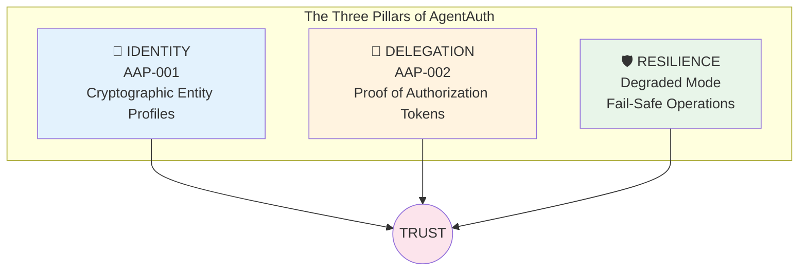
```mermaid
graph TB
    subgraph "The Three Pillars of AgentAuth"
        I[🔐 IDENTITY<br/>AAP-001<br/>Cryptographic Entity Profiles]
        D[📜 DELEGATION<br/>AAP-002<br/>Proof of Authorization Tokens]
        R[🛡️ RESILIENCE<br/>Degraded Mode<br/>Fail-Safe Operations]
    end
    
    I --> T((TRUST))
    D --> T
    R --> T
    
    style I fill:#e3f2fd
    style D fill:#fff3e0
    style R fill:#e8f5e9
    style T fill:#fce4ec
```

**Figure 2.1: The three pillars supporting trustworthy autonomous operation**

---

## 2.2 Pillar 1: Identity (AAP-001)

### The Entity Profile

In traditional systems, identity is a database row. In AgentAuth, identity is a **cryptographic proof**.

```json
{
  "profile_version": "1.0",
  "entity_id": "urn:agentauth:entity:acme-procurement-bot-7",
  "entity_type": "autonomous_agent",
  "public_key": {
    "algorithm": "Ed25519",
    "key": "MCowBQYDK2VwAyEAp6s7p8K2H3R4T5u6V7w8X9..."
  },
  "legal_metadata": {
    "owning_organization": {
      "name": "Acme Corporation",
      "jurisdiction": "DE",
      "registration": "HRB 123456",
      "register": "Amtsgericht München"
    },
    "agent_classification": "L3_AUTONOMOUS",
    "liability_cap_eur": 1000000
  },
  "authorization_chain": {
    "root_authorizer": "urn:agentauth:entity:acme-board-resolution-2024",
    "chain_depth": 2,
    "chain_signature": "..."
  },
  "validity": {
    "not_before": "2025-01-01T00:00:00Z",
    "not_after": "2026-01-01T00:00:00Z"
  },
  "signature": "..."
}
```

**Example 2.1: An AgentAuth Entity Profile for an autonomous procurement agent**

### The Authorization Chain

Authority flows from humans to agents through a verifiable chain:

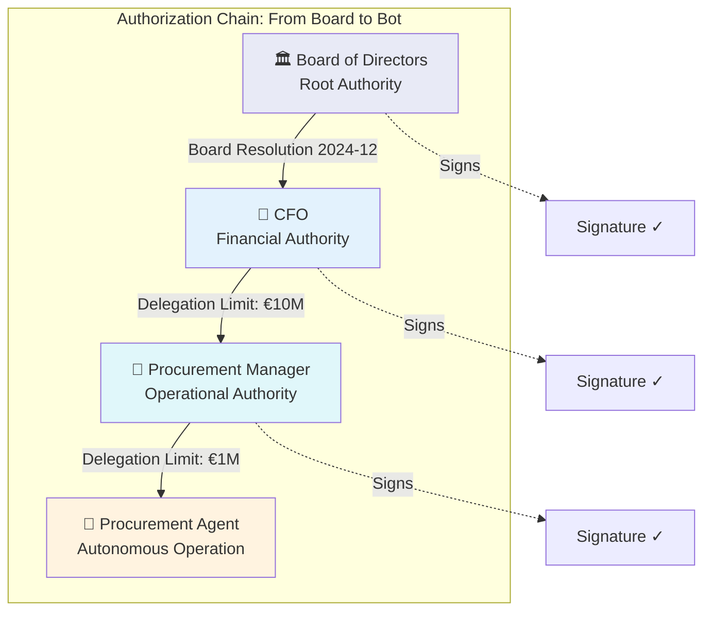
```mermaid
graph TB
    subgraph "Authorization Chain: From Board to Bot"
        B[🏛️ Board of Directors<br/>Root Authority]
        B -->|Board Resolution 2024-12| C[👔 CFO<br/>Financial Authority]
        C -->|Delegation Limit: €10M| P[👤 Procurement Manager<br/>Operational Authority]
        P -->|Delegation Limit: €1M| A[🤖 Procurement Agent<br/>Autonomous Operation]
    end
    
    B -.->|Signs| S1[Signature ✓]
    C -.->|Signs| S2[Signature ✓]
    P -.->|Signs| S3[Signature ✓]
    
    style B fill:#e8eaf6
    style C fill:#e3f2fd
    style P fill:#e0f7fa
    style A fill:#fff3e0
```

**Figure 2.2: Authority delegation chain — from corporate governance to autonomous agent**

Each link in the chain:
- Is cryptographically signed by the delegator
- Contains the scope of delegated authority
- Cannot exceed the delegator's own authority
- Can be independently verified

---

## 2.3 Pillar 2: Delegation (AAP-002)

### The Proof of Authorization Token

The PoA token is the primary artifact for agent authorization:

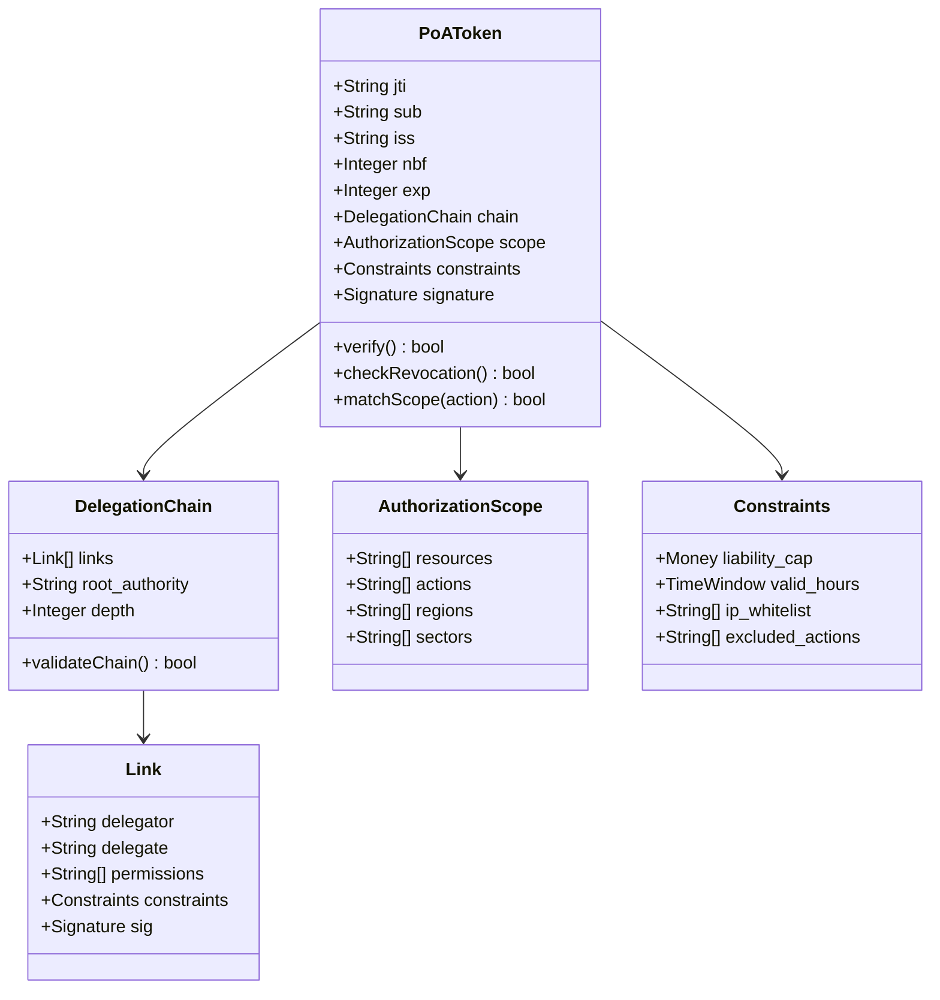
```mermaid
classDiagram
    class PoAToken {
        +String jti
        +String sub
        +String iss
        +Integer nbf
        +Integer exp
        +DelegationChain chain
        +AuthorizationScope scope
        +Constraints constraints
        +Signature signature
        +verify() bool
        +checkRevocation() bool
        +matchScope(action) bool
    }
    
    class DelegationChain {
        +Link[] links
        +String root_authority
        +Integer depth
        +validateChain() bool
    }
    
    class Link {
        +String delegator
        +String delegate
        +String[] permissions
        +Constraints constraints
        +Signature sig
    }
    
    class AuthorizationScope {
        +String[] resources
        +String[] actions
        +String[] regions
        +String[] sectors
    }
    
    class Constraints {
        +Money liability_cap
        +TimeWindow valid_hours
        +String[] ip_whitelist
        +String[] excluded_actions
    }
    
    PoAToken --> DelegationChain
    DelegationChain --> Link
    PoAToken --> AuthorizationScope
    PoAToken --> Constraints
```

**Figure 2.3: PoA Token structure — comprehensive authorization metadata**

### Real-World Example: German Corporate Procurement

A German GmbH wants to authorize an AI agent for procurement. Here's the complete PoA:

```json
{
  "poa_version": "2.0",
  "jti": "poa-2025-12-001-proc",
  
  "principal": {
    "type": "organization",
    "identity": "DE:HRB:123456",
    "name": "Mustermann GmbH",
    "jurisdiction": "DE",
    "commercial_register": {
      "authority": "Amtsgericht München",
      "registration_number": "HRB 123456",
      "registration_date": "2015-03-15"
    }
  },
  
  "agent": {
    "type": "autonomous_agent",
    "identity": "urn:agentauth:agent:mustermann-proc-7",
    "capability_level": "L3",
    "version": "1.2.0"
  },
  
  "authorization": {
    "actions": [
      "procurement:create",
      "procurement:approve",
      "payment:initiate"
    ],
    "resources": [
      "category:office_supplies",
      "category:it_equipment"
    ],
    "excluded_actions": [
      "payment:international",
      "vendor:new_registration"
    ],
    "regions": ["DE", "AT", "CH"]
  },
  
  "constraints": {
    "liability_cap": {
      "currency": "EUR",
      "amount": 50000,
      "period": "per_transaction"
    },
    "daily_limit": {
      "currency": "EUR", 
      "amount": 200000
    },
    "approval_required_above": {
      "currency": "EUR",
      "amount": 25000
    },
    "valid_hours": {
      "timezone": "Europe/Berlin",
      "days": ["Mon", "Tue", "Wed", "Thu", "Fri"],
      "hours": "08:00-18:00"
    }
  },
  
  "chain": [
    {
      "delegator": "DE:HRB:123456:BOARD",
      "delegate": "DE:HRB:123456:CFO:Max.Mustermann",
      "authority_type": "statutory",
      "legal_basis": "GmbHG §35",
      "granted": "2024-01-15",
      "signature": "..."
    },
    {
      "delegator": "DE:HRB:123456:CFO:Max.Mustermann",
      "delegate": "urn:agentauth:agent:mustermann-proc-7",
      "authority_type": "delegated",
      "legal_basis": "Internal Delegation Policy §4.2",
      "granted": "2025-01-01",
      "constraints_narrowed": true,
      "signature": "..."
    }
  ],
  
  "validity": {
    "not_before": "2025-01-01T00:00:00Z",
    "not_after": "2025-12-31T23:59:59Z"
  },
  
  "revocation_endpoint": "https://auth.mustermann.de/revocation",
  
  "signature": {
    "algorithm": "EdDSA",
    "kid": "agent-signing-key-2025",
    "value": "..."
  }
}
```

**Example 2.2: Complete PoA for a German corporate procurement agent**

This PoA enables any receiver to verify:
1. ✅ The agent is authorized by Mustermann GmbH
2. ✅ The authorization chain traces to statutory authority (GmbHG §35)
3. ✅ The transaction is within scope (office supplies, IT equipment)
4. ✅ The amount is within liability cap (€50,000 per transaction)
5. ✅ The action occurs during business hours

---

## 2.4 Pillar 3: Resilience (Degraded Mode)

What happens when the verification infrastructure fails? AgentAuth implements **graceful degradation**:

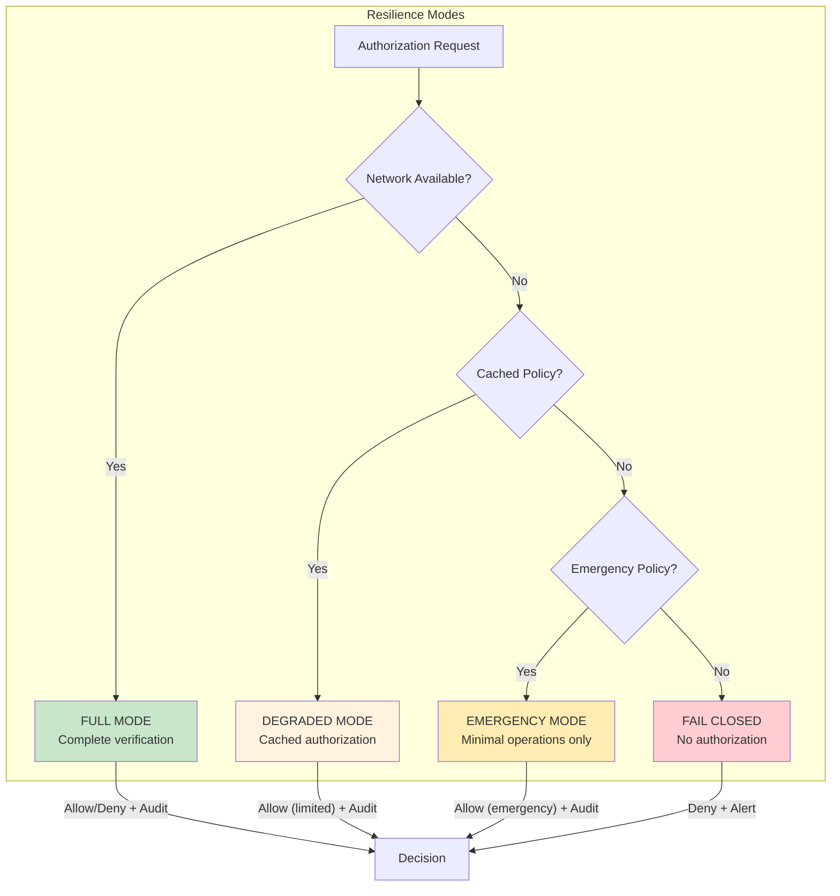
```mermaid
graph TD
    subgraph "Resilience Modes"
        R[Authorization Request]
        
        R --> N{Network Available?}
        N -->|Yes| F[FULL MODE<br/>Complete verification]
        N -->|No| C{Cached Policy?}
        
        C -->|Yes| D[DEGRADED MODE<br/>Cached authorization]
        C -->|No| E{Emergency Policy?}
        
        E -->|Yes| EM[EMERGENCY MODE<br/>Minimal operations only]
        E -->|No| FAIL[FAIL CLOSED<br/>No authorization]
    end
    
    F -->|Allow/Deny + Audit| OUT[Decision]
    D -->|"Allow (limited) + Audit"| OUT
    EM -->|"Allow (emergency) + Audit"| OUT
    FAIL -->|Deny + Alert| OUT
    
    style F fill:#c8e6c9
    style D fill:#fff3e0
    style EM fill:#ffecb3
    style FAIL fill:#ffcdd2
```

**Figure 2.4: Resilience modes — graceful degradation under failure conditions**

| Mode | Conditions | Capabilities | Audit |
|------|------------|--------------|-------|
| **Full** | All services available | Complete verification, full scope | Real-time |
| **Degraded** | Revocation service down | Cached policies, reduced limits | Buffered |
| **Emergency** | Critical infrastructure failure | Pre-approved emergency actions only | Local |
| **Fail Closed** | No valid policy available | No authorization | Alert |

---

# Chapter 3: The Technical Implementation

## 3.1 System Architecture

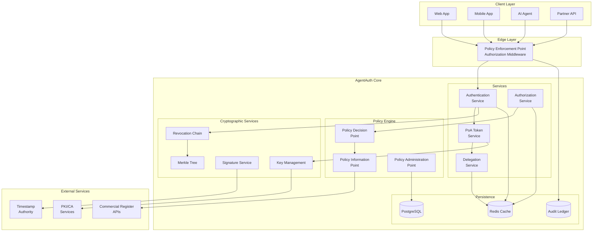
```mermaid
graph TB
    subgraph "Client Layer"
        A1[Web App]
        A2[Mobile App]
        A3[AI Agent]
        A4[Partner API]
    end
    
    subgraph "Edge Layer"
        PEP[Policy Enforcement Point<br/>Authorization Middleware]
    end
    
    subgraph "AgentAuth Core"
        subgraph "Services"
            AUTH[Authentication<br/>Service]
            AUTHZ[Authorization<br/>Service]
            POA[PoA Token<br/>Service]
            DEL[Delegation<br/>Service]
        end
        
        subgraph "Policy Engine"
            PDP[Policy Decision<br/>Point]
            PIP[Policy Information<br/>Point]
            PAP[Policy Administration<br/>Point]
        end
        
        subgraph "Cryptographic Services"
            KEY[Key Management]
            SIG[Signature Service]
            REV[Revocation Chain]
            MKL[Merkle Tree]
        end
        
        subgraph "Persistence"
            REDIS[(Redis Cache)]
            PG[(PostgreSQL)]
            AUDIT[(Audit Ledger)]
        end
    end
    
    subgraph "External Services"
        CR[Commercial Register<br/>APIs]
        TSA[Timestamp<br/>Authority]
        PKI[PKI/CA<br/>Services]
    end
    
    A1 & A2 & A3 & A4 --> PEP
    PEP --> AUTH
    AUTH --> POA
    AUTH --> REV
    POA --> DEL
    POA --> KEY
    AUTHZ --> PDP
    PDP --> PIP
    PIP --> CR
    SIG --> TSA
    KEY --> PKI
    
    AUTH & AUTHZ & DEL --> REDIS
    PAP --> PG
    REV --> MKL
    PEP --> AUDIT
```

**Figure 3.1: Complete AgentAuth system architecture**

---

## 3.2 Core Data Flows

### Flow 1: PoA Token Issuance

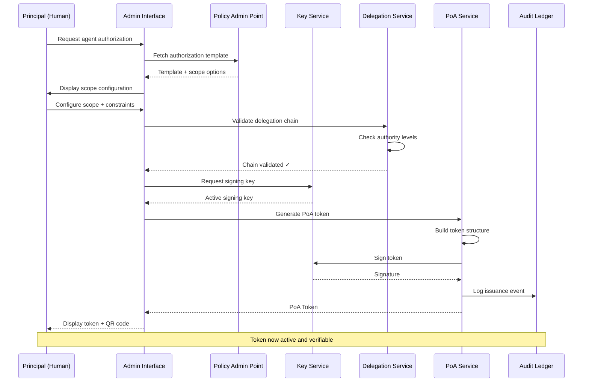
```mermaid
sequenceDiagram
    participant P as Principal (Human)
    participant UI as Admin Interface
    participant PAP as Policy Admin Point
    participant KEY as Key Service
    participant DEL as Delegation Service
    participant POA as PoA Service
    participant AUD as Audit Ledger
    
    P->>UI: Request agent authorization
    UI->>PAP: Fetch authorization template
    PAP-->>UI: Template + scope options
    UI->>P: Display scope configuration
    P->>UI: Configure scope + constraints
    UI->>DEL: Validate delegation chain
    DEL->>DEL: Check authority levels
    DEL-->>UI: Chain validated ✓
    UI->>KEY: Request signing key
    KEY-->>UI: Active signing key
    UI->>POA: Generate PoA token
    POA->>POA: Build token structure
    POA->>KEY: Sign token
    KEY-->>POA: Signature
    POA->>AUD: Log issuance event
    POA-->>UI: PoA Token
    UI-->>P: Display token + QR code
    
    Note over P,AUD: Token now active and verifiable
```

**Figure 3.2: PoA token issuance flow — from principal request to signed token**

### Flow 2: Authorization Decision

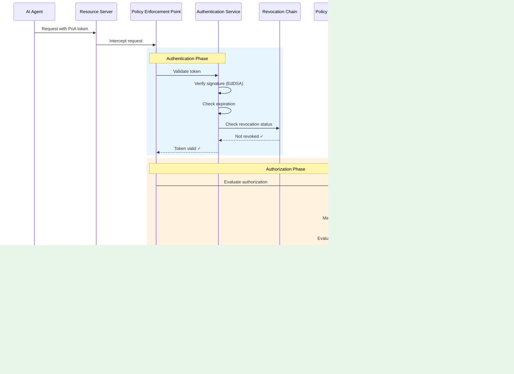
```mermaid
sequenceDiagram
    participant A as AI Agent
    participant RS as Resource Server
    participant PEP as Policy Enforcement Point
    participant AUTH as Authentication Service
    participant REV as Revocation Chain
    participant PDP as Policy Decision Point
    participant PIP as Policy Information Point
    participant AUD as Audit Ledger
    
    A->>RS: Request with PoA token
    RS->>PEP: Intercept request
    
    rect rgb(230, 245, 255)
        Note over PEP,AUTH: Authentication Phase
        PEP->>AUTH: Validate token
        AUTH->>AUTH: Verify signature (EdDSA)
        AUTH->>AUTH: Check expiration
        AUTH->>REV: Check revocation status
        REV-->>AUTH: Not revoked ✓
        AUTH-->>PEP: Token valid ✓
    end
    
    rect rgb(255, 243, 224)
        Note over PEP,PIP: Authorization Phase
        PEP->>PDP: Evaluate authorization
        PDP->>PIP: Fetch context
        PIP-->>PDP: User attributes, resource metadata
        PDP->>PDP: Match policies
        PDP->>PDP: Evaluate conditions
        PDP-->>PEP: PERMIT + obligations
    end
    
    rect rgb(232, 245, 233)
        Note over PEP,AUD: Execution Phase
        PEP->>PEP: Execute obligations
        PEP->>AUD: Log decision
        PEP-->>RS: Forward request
        RS-->>A: Response
    end
```

**Figure 3.3: Authorization decision flow — complete verification pipeline**

---

## 3.3 Cryptographic Architecture

### Supported Algorithms

AgentAuth implements algorithm agility to support evolving cryptographic standards:

| Algorithm | Purpose | Strength | Post-Quantum |
|-----------|---------|----------|--------------|
| **Ed25519** | Signatures (default) | 128-bit | ❌ |
| **ECDSA P-256** | Signatures (legacy) | 128-bit | ❌ |
| **ECDSA P-384** | Signatures (high security) | 192-bit | ❌ |
| **BLS12-381** | Aggregate signatures | 128-bit | ❌ |
| **Dilithium-3** | Signatures (future) | 192-bit | ✅ |
| **SHA-256** | Hashing | 128-bit | ✅ |
| **SHA-384** | Hashing (high security) | 192-bit | ✅ |

### Multi-Signature Support

For high-value transactions, AgentAuth supports threshold signatures:

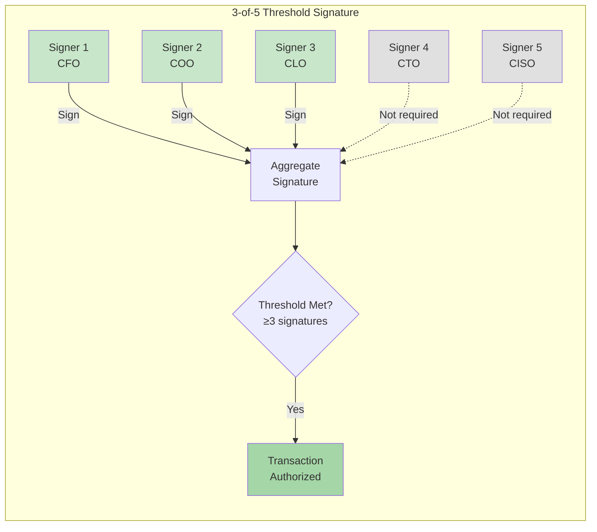
```mermaid
graph LR
    subgraph "3-of-5 Threshold Signature"
        S1[Signer 1<br/>CFO]
        S2[Signer 2<br/>COO]
        S3[Signer 3<br/>CLO]
        S4[Signer 4<br/>CTO]
        S5[Signer 5<br/>CISO]
        
        S1 -->|Sign| AGG[Aggregate<br/>Signature]
        S2 -->|Sign| AGG
        S3 -->|Sign| AGG
        S4 -.->|Not required| AGG
        S5 -.->|Not required| AGG
        
        AGG --> V{Threshold Met?<br/>≥3 signatures}
        V -->|Yes| VALID[Transaction<br/>Authorized]
    end
    
    style S1 fill:#c8e6c9
    style S2 fill:#c8e6c9
    style S3 fill:#c8e6c9
    style S4 fill:#e0e0e0
    style S5 fill:#e0e0e0
    style VALID fill:#a5d6a7
```

**Figure 3.4: Multi-signature threshold scheme for high-value authorizations**

---

## 3.4 Revocation Transparency

AgentAuth implements append-only Merkle tree-based revocation:

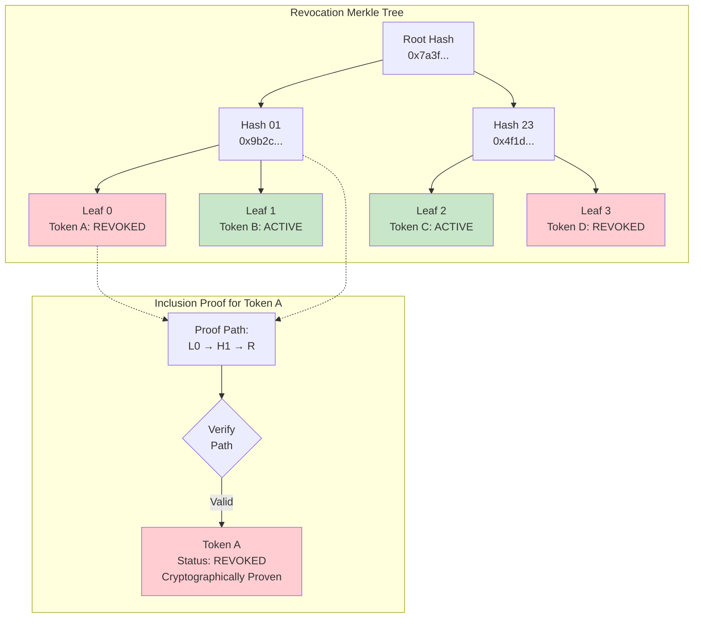
```mermaid
graph TB
    subgraph "Revocation Merkle Tree"
        R[Root Hash<br/>0x7a3f...]
        
        R --> H1[Hash 01<br/>0x9b2c...]
        R --> H2[Hash 23<br/>0x4f1d...]
        
        H1 --> L0[Leaf 0<br/>Token A: REVOKED]
        H1 --> L1[Leaf 1<br/>Token B: ACTIVE]
        H2 --> L2[Leaf 2<br/>Token C: ACTIVE]
        H2 --> L3[Leaf 3<br/>Token D: REVOKED]
    end
    
    subgraph "Inclusion Proof for Token A"
        IP[Proof Path:<br/>L0 → H1 → R]
        L0 -.-> IP
        H1 -.-> IP
        IP --> VP{Verify<br/>Path}
        VP -->|Valid| CONF[Token A<br/>Status: REVOKED<br/>Cryptographically Proven]
    end
    
    style L0 fill:#ffcdd2
    style L3 fill:#ffcdd2
    style L1 fill:#c8e6c9
    style L2 fill:#c8e6c9
    style CONF fill:#ffcdd2
```

**Figure 3.5: Merkle tree-based revocation with inclusion proofs**

Benefits:
- **Append-only**: Revocations cannot be hidden
- **Verifiable**: Any party can verify status
- **Efficient**: O(log n) inclusion proofs
- **Timestamped**: External anchoring proves timing

---

# Chapter 4: Legal Frameworks Across Jurisdictions

## 4.1 The Universal Challenge

AI agents must operate across jurisdictions with different legal traditions. AgentAuth maps these differences:

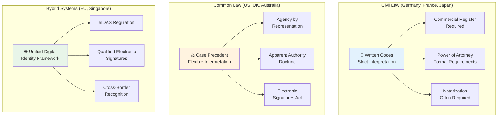
```mermaid
graph TB
    subgraph "Civil Law (Germany, France, Japan)"
        CL[📜 Written Codes<br/>Strict Interpretation]
        CL --> CL1[Commercial Register<br/>Required]
        CL --> CL2[Power of Attorney<br/>Formal Requirements]
        CL --> CL3[Notarization<br/>Often Required]
    end
    
    subgraph "Common Law (US, UK, Australia)"
        COM[⚖️ Case Precedent<br/>Flexible Interpretation]
        COM --> COM1[Agency by<br/>Representation]
        COM --> COM2[Apparent Authority<br/>Doctrine]
        COM --> COM3[Electronic<br/>Signatures Act]
    end
    
    subgraph "Hybrid Systems (EU, Singapore)"
        HYB[🌐 Unified Digital<br/>Identity Framework]
        HYB --> HYB1[eIDAS Regulation]
        HYB --> HYB2[Qualified Electronic<br/>Signatures]
        HYB --> HYB3[Cross-Border<br/>Recognition]
    end
    
    style CL fill:#e3f2fd
    style COM fill:#fff3e0
    style HYB fill:#e8f5e9
```

**Figure 4.1: Legal framework categories and their implications for AI authorization**

---

## 4.2 Germany: The Commercial Register Model

Germany's Commercial Register (Handelsregister) provides a template for verifiable corporate authority.

### German Implementation Pattern

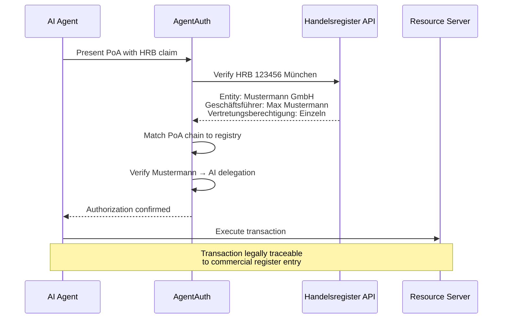
```mermaid
sequenceDiagram
    participant AI as AI Agent
    participant AG as AgentAuth
    participant HR as Handelsregister API
    participant RS as Resource Server
    
    AI->>AG: Present PoA with HRB claim
    AG->>HR: Verify HRB 123456 München
    HR-->>AG: Entity: Mustermann GmbH<br/>Geschäftsführer: Max Mustermann<br/>Vertretungsberechtigung: Einzeln
    AG->>AG: Match PoA chain to registry
    AG->>AG: Verify Mustermann → AI delegation
    AG-->>AI: Authorization confirmed
    AI->>RS: Execute transaction
    
    Note over AI,RS: Transaction legally traceable<br/>to commercial register entry
```

**Figure 4.2: German commercial register integration flow**

### Key Legal Provisions

| Provision | Implication for AI Agents |
|-----------|--------------------------|
| **§164 BGB** | Agent acts in name of principal |
| **§35 GmbHG** | Managing directors represent company |
| **§49 HGB** | *Prokura* (commercial power of attorney) |
| **§166 BGB** | Knowledge imputed to principal |

---

## 4.3 United States: The Apparent Authority Model

US law recognizes "apparent authority" — if a third party reasonably believes an agent is authorized, the principal may be bound.

### Implications for AgentAuth

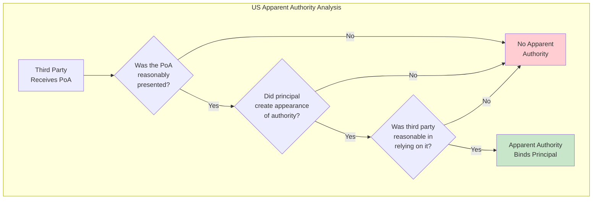
```mermaid
graph TD
    subgraph "US Apparent Authority Analysis"
        TP[Third Party<br/>Receives PoA]
        
        TP --> Q1{Was the PoA<br/>reasonably<br/>presented?}
        Q1 -->|Yes| Q2{Did principal<br/>create appearance<br/>of authority?}
        Q1 -->|No| NA[No Apparent<br/>Authority]
        
        Q2 -->|Yes| Q3{Was third party<br/>reasonable in<br/>relying on it?}
        Q2 -->|No| NA
        
        Q3 -->|Yes| AA[Apparent Authority<br/>Binds Principal]
        Q3 -->|No| NA
    end
    
    style AA fill:#c8e6c9
    style NA fill:#ffcdd2
```

**Figure 4.3: US apparent authority doctrine analysis**

This creates a **higher bar for AgentAuth verification** in US contexts:
- Principals must explicitly define agent scope
- Scope must be verifiable by third parties
- Over-broad grants create liability risk

---

## 4.4 European Union: The eIDAS Framework

The EU's eIDAS Regulation provides a unified framework for electronic identification and trust services.

### eIDAS Trust Levels

| Level | Verification | AgentAuth Equivalent |
|-------|-------------|---------------------|
| **Low** | Self-asserted | Entity Profile (unsigned) |
| **Substantial** | Identity verified | Entity Profile + KYC |
| **High** | In-person + qualified cert | Entity Profile + QES |

### AgentAuth eIDAS Integration

```json
{
  "identity_verification": {
    "method": "eIDAS",
    "trust_level": "substantial",
    "issuing_country": "DE",
    "verification_service": "urn:eidas:de:bundesnetzagentur",
    "verification_date": "2025-01-15T10:30:00Z",
    "verification_proof": {
      "assertion_id": "eidas-de-2025-001234",
      "signature": "..."
    }
  }
}
```

**Example 4.1: eIDAS identity verification integrated into AgentAuth entity profile**

---

# Chapter 5: Building Trustworthy Agents

## 5.1 The Agent Capability Levels

AgentAuth defines capability levels based on autonomy:

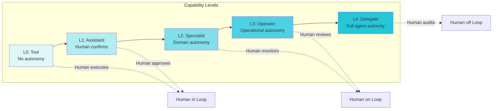
```mermaid
graph LR
    subgraph "Capability Levels"
        L0[L0: Tool<br/>No autonomy]
        L1[L1: Assistant<br/>Human confirms]
        L2[L2: Specialist<br/>Domain autonomy]
        L3[L3: Operator<br/>Operational autonomy]
        L4[L4: Delegate<br/>Full agent authority]
    end
    
    L0 --> L1 --> L2 --> L3 --> L4
    
    L0 -.->|Human executes| HH[Human in Loop]
    L1 -.->|Human approves| HH
    L2 -.->|Human monitors| HM[Human on Loop]
    L3 -.->|Human reviews| HM
    L4 -.->|Human audits| HA[Human off Loop]
    
    style L0 fill:#e0f7fa
    style L1 fill:#b2ebf2
    style L2 fill:#80deea
    style L3 fill:#4dd0e1
    style L4 fill:#26c6da
```

**Figure 5.1: Agent capability levels and human oversight requirements**

### Capability Level Requirements

| Level | Authorization | Constraints | Example |
|-------|--------------|-------------|---------|
| **L0** | None required | N/A | Calculator tool |
| **L1** | Scope-limited | All actions approved | Email draft assistant |
| **L2** | Domain PoA | Domain boundaries | Customer support bot |
| **L3** | Full PoA + limits | Financial/temporal limits | Procurement agent |
| **L4** | Full PoA + audit | Regulatory supervision | Trading algorithm |

---

## 5.2 Implementing a Procurement Agent

### Step 1: Define the Entity Profile

```go
// Create entity profile for procurement agent
profile := &agentauth.EntityProfile{
    EntityID: "urn:agentauth:agent:acme-proc-001",
    Type:     agentauth.EntityTypeAgent,
    PublicKey: agentauth.PublicKey{
        Algorithm: "Ed25519",
        KeyBytes:  publicKeyBytes,
    },
    LegalMetadata: agentauth.LegalMetadata{
        Organization: agentauth.Organization{
            Name:         "Acme Corporation",
            Jurisdiction: "DE",
            RegisterID:   "HRB 123456",
        },
        CapabilityLevel: agentauth.CapabilityL3,
        LiabilityCap:    agentauth.Money{Amount: 1000000, Currency: "EUR"},
    },
    Validity: agentauth.Validity{
        NotBefore: time.Now(),
        NotAfter:  time.Now().AddDate(1, 0, 0),
    },
}
```

**Example 5.1: Entity profile creation in Go**

### Step 2: Issue PoA Token

```go
// Build PoA for procurement operations
poa := &agentauth.PoA{
    JTI:  uuid.New().String(),
    Sub:  "urn:agentauth:agent:acme-proc-001",
    Iss:  "urn:agentauth:issuer:acme-auth",
    Chain: agentauth.DelegationChain{
        Links: []agentauth.DelegationLink{
            {
                Delegator: "DE:HRB:123456:BOARD",
                Delegate:  "DE:HRB:123456:CFO",
                Authority: agentauth.AuthorityStatutory,
                Signature: boardSignature,
            },
            {
                Delegator: "DE:HRB:123456:CFO",
                Delegate:  "urn:agentauth:agent:acme-proc-001",
                Authority: agentauth.AuthorityDelegated,
                Scope: agentauth.Scope{
                    Resources: []string{"procurement:*"},
                    Actions:   []string{"create", "approve", "payment:domestic"},
                },
                Constraints: agentauth.Constraints{
                    LiabilityCap: agentauth.Money{Amount: 50000, Currency: "EUR"},
                    ValidHours:   []string{"Mon-Fri 08:00-18:00 Europe/Berlin"},
                },
                Signature: cfoSignature,
            },
        },
    },
    Validity: agentauth.Validity{
        NotBefore: time.Now(),
        NotAfter:  time.Now().AddDate(0, 3, 0), // 3 months
    },
}

// Sign the PoA
signedPoA, err := poaService.Sign(poa, signingKey)
```

**Example 5.2: PoA token issuance with delegation chain**

### Step 3: Execute Authorized Transaction

```go
// Agent executes procurement
func (agent *ProcurementAgent) PlaceOrder(order *Order) error {
    // Attach PoA to request
    ctx := agentauth.WithPoA(context.Background(), agent.poaToken)
    
    // Call procurement API
    resp, err := agent.procurementClient.CreateOrder(ctx, &CreateOrderRequest{
        Vendor:      order.Vendor,
        Items:       order.Items,
        TotalAmount: order.TotalAmount,
    })
    
    if err != nil {
        // Handle authorization failure
        if errors.Is(err, agentauth.ErrAuthorizationDenied) {
            return fmt.Errorf("order exceeds agent authority: %w", err)
        }
        return err
    }
    
    return nil
}
```

**Example 5.3: Agent executing an authorized transaction**

---

## 5.3 Verification Workflow

The receiving system verifies the PoA:

```go
// Verification middleware
func VerifyPoA(next http.Handler) http.Handler {
    return http.HandlerFunc(func(w http.ResponseWriter, r *http.Request) {
        // Extract PoA from request
        poa, err := agentauth.ExtractPoA(r)
        if err != nil {
            http.Error(w, "Missing PoA", http.StatusUnauthorized)
            return
        }
        
        // Comprehensive verification
        result, err := verifier.Verify(r.Context(), poa, &agentauth.VerifyOptions{
            CheckRevocation:    true,
            CheckChainValidity: true,
            CheckConstraints:   true,
            RequiredScope: &agentauth.Scope{
                Resources: []string{"procurement:orders"},
                Actions:   []string{"create"},
            },
            TransactionContext: &agentauth.TransactionContext{
                Amount:   extractAmount(r),
                Currency: "EUR",
            },
        })
        
        if err != nil || !result.Valid {
            auditLog.Warn("PoA verification failed",
                "poa_id", poa.JTI,
                "reason", result.DenialReason,
            )
            http.Error(w, "Authorization denied", http.StatusForbidden)
            return
        }
        
        // Attach verification result to context
        ctx := agentauth.WithVerification(r.Context(), result)
        next.ServeHTTP(w, r.WithContext(ctx))
    })
}
```

**Example 5.4: PoA verification middleware**

---

# Chapter 6: Operational Excellence

## 6.1 Observability

AgentAuth provides comprehensive observability:

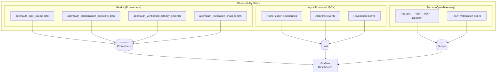
```mermaid
graph TB
    subgraph "Observability Stack"
        subgraph "Metrics (Prometheus)"
            M1[agentauth_poa_issued_total]
            M2[agentauth_authorization_decisions_total]
            M3[agentauth_verification_latency_seconds]
            M4[agentauth_revocation_chain_length]
        end
        
        subgraph "Logs (Structured JSON)"
            L1["Authorization decision log"]
            L2["Audit trail events"]
            L3["Revocation events"]
        end
        
        subgraph "Traces (OpenTelemetry)"
            T1[Request → PEP → PDP → Decision]
            T2[Token Verification Spans]
        end
    end
    
    M1 & M2 & M3 & M4 --> PROM[(Prometheus)]
    L1 & L2 & L3 --> LOKI[(Loki)]
    T1 & T2 --> TEMPO[(Tempo)]
    PROM & LOKI & TEMPO --> GRAF[Grafana<br/>Dashboards]
```

**Figure 6.1: AgentAuth observability architecture**

### Key Metrics

| Metric | Type | Description |
|--------|------|-------------|
| `agentauth_poa_issued_total` | Counter | PoA tokens issued |
| `agentauth_authorization_decisions_total` | Counter | Authorization decisions (by outcome) |
| `agentauth_verification_latency_seconds` | Histogram | Verification latency distribution |
| `agentauth_revocation_chain_depth` | Gauge | Current revocation chain depth |
| `agentauth_delegation_chain_depth` | Histogram | Delegation chain depth distribution |
| `agentauth_constraint_violations_total` | Counter | Constraint violations (by type) |

---

## 6.2 Audit & Compliance

### Cryptographic Audit Trail

Every authorization decision is recorded in an append-only audit ledger:

```json
{
  "audit_id": "aud-2025-12-30-001234",
  "timestamp": "2025-12-30T14:23:45.123Z",
  "event_type": "AUTHORIZATION_DECISION",
  "decision": "PERMIT",
  "request": {
    "poa_id": "poa-2025-001",
    "action": "procurement:create",
    "resource": "orders/PO-2025-9876",
    "amount": {"value": 45000, "currency": "EUR"}
  },
  "verification": {
    "chain_valid": true,
    "chain_depth": 2,
    "revocation_checked": true,
    "constraints_satisfied": true
  },
  "context": {
    "source_ip": "10.0.1.50",
    "user_agent": "AcmeProcBot/1.2.0"
  },
  "digest": "sha256:7a3f9b2c4d5e6f...",
  "previous_digest": "sha256:4f1d8e3a2b6c...",
  "signature": "..."
}
```

**Example 6.1: Cryptographic audit entry**

### External Anchoring

For regulatory compliance, audit entries are anchored to external timestamping authorities:

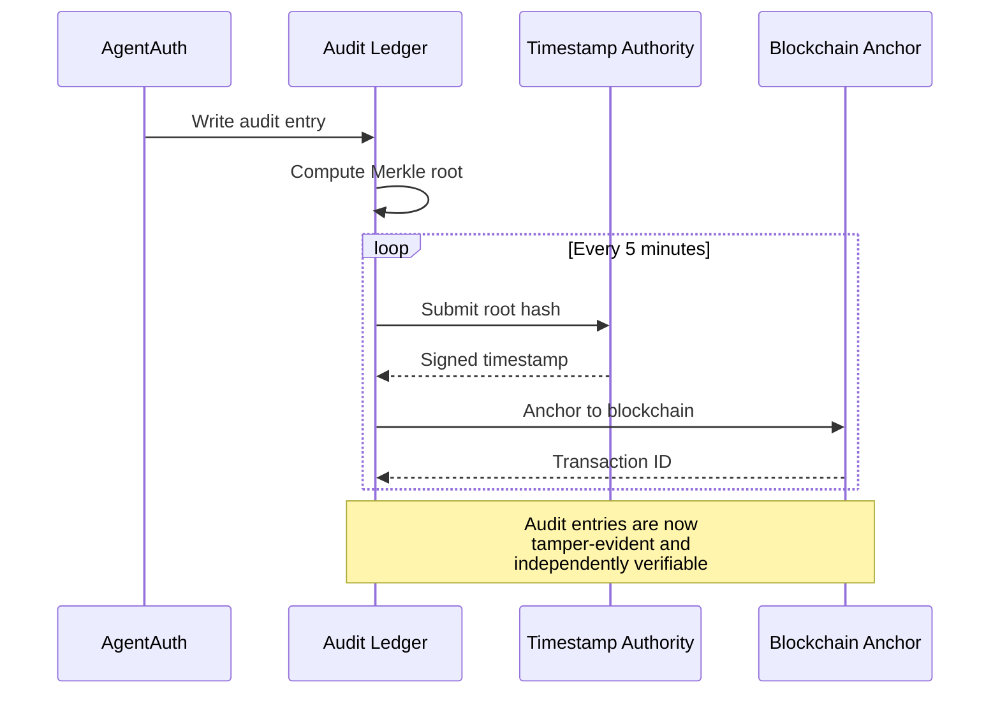
```mermaid
sequenceDiagram
    participant AG as AgentAuth
    participant AL as Audit Ledger
    participant TSA as Timestamp Authority
    participant BC as Blockchain Anchor
    
    AG->>AL: Write audit entry
    AL->>AL: Compute Merkle root
    
    loop Every 5 minutes
        AL->>TSA: Submit root hash
        TSA-->>AL: Signed timestamp
        AL->>BC: Anchor to blockchain
        BC-->>AL: Transaction ID
    end
    
    Note over AL,BC: Audit entries are now<br/>tamper-evident and<br/>independently verifiable
```

**Figure 6.2: External audit anchoring flow**

---

# Chapter 7: Advanced Patterns

## 7.1 Multi-Party Authorization

Some transactions require multiple approvals:

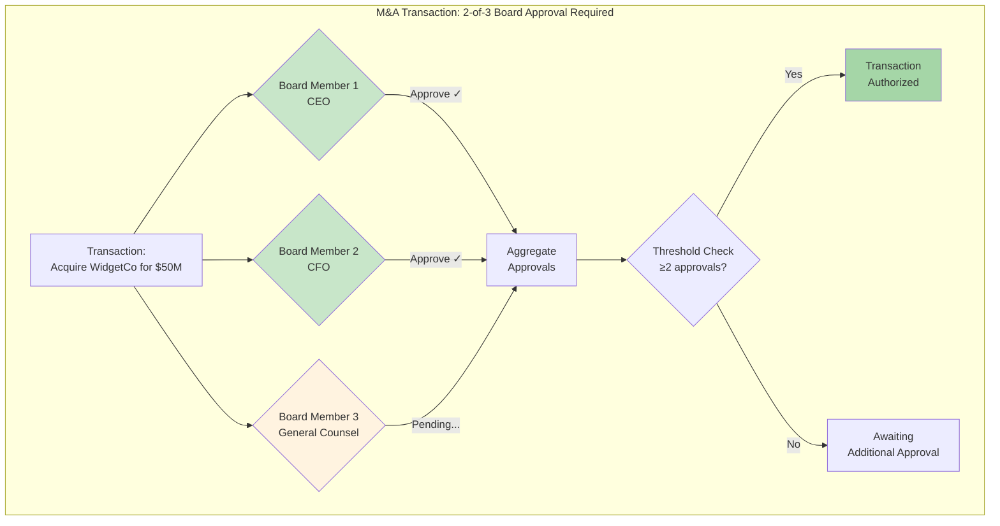
```mermaid
graph TD
    subgraph "M&A Transaction: 2-of-3 Board Approval Required"
        TX[Transaction:<br/>Acquire WidgetCo for $50M]
        
        TX --> B1{Board Member 1<br/>CEO}
        TX --> B2{Board Member 2<br/>CFO}
        TX --> B3{Board Member 3<br/>General Counsel}
        
        B1 -->|Approve ✓| AGG[Aggregate<br/>Approvals]
        B2 -->|Approve ✓| AGG
        B3 -->|Pending...| AGG
        
        AGG --> TH{Threshold Check<br/>≥2 approvals?}
        TH -->|Yes| AUTH[Transaction<br/>Authorized]
        TH -->|No| WAIT[Awaiting<br/>Additional Approval]
    end
    
    style B1 fill:#c8e6c9
    style B2 fill:#c8e6c9
    style B3 fill:#fff3e0
    style AUTH fill:#a5d6a7
```

**Figure 7.1: Multi-party authorization with threshold approval**

---

## 7.2 Conditional Delegation

Delegations can include dynamic conditions:

```json
{
  "constraints": {
    "conditions": [
      {
        "type": "market_price",
        "asset": "AAPL",
        "operator": "less_than",
        "value": 200.00,
        "oracle": "urn:agentauth:oracle:nasdaq"
      },
      {
        "type": "risk_score",
        "operator": "less_than",
        "value": 0.7,
        "oracle": "urn:agentauth:oracle:risk-engine"
      }
    ],
    "condition_logic": "ALL"
  }
}
```

**Example 7.1: Conditional delegation with external oracles**

---

## 7.3 Cascade Revocation

When a delegation is revoked, all derived delegations are automatically revoked:

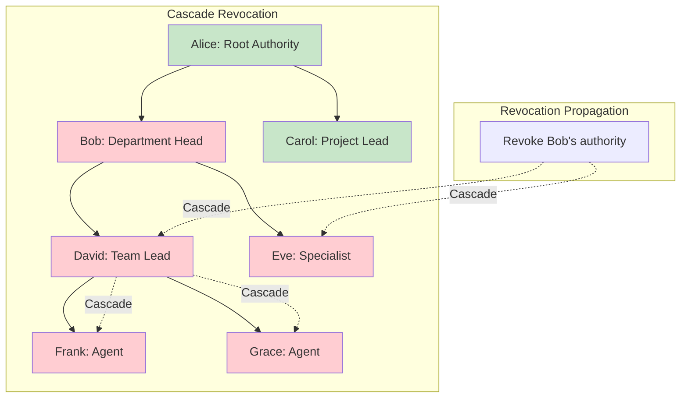
```mermaid
graph TD
    subgraph "Cascade Revocation"
        A[Alice: Root Authority]
        
        A --> B[Bob: Department Head]
        A --> C[Carol: Project Lead]
        
        B --> D[David: Team Lead]
        B --> E[Eve: Specialist]
        
        D --> F[Frank: Agent]
        D --> G[Grace: Agent]
    end
    
    subgraph "Revocation Propagation"
        REV[Revoke Bob's authority]
        REV -.->|Cascade| D
        REV -.->|Cascade| E
        D -.->|Cascade| F
        D -.->|Cascade| G
    end
    
    style B fill:#ffcdd2
    style D fill:#ffcdd2
    style E fill:#ffcdd2
    style F fill:#ffcdd2
    style G fill:#ffcdd2
    style A fill:#c8e6c9
    style C fill:#c8e6c9
```

**Figure 7.2: Cascade revocation — revoking Bob's authority revokes all derived delegations**

---

# Appendix A: Quick Reference

## A.1 PoA Token Claims

| Claim | Type | Required | Description |
|-------|------|----------|-------------|
| `jti` | String | ✅ | Unique token identifier |
| `sub` | String | ✅ | Agent identity |
| `iss` | String | ✅ | Token issuer |
| `nbf` | Integer | ✅ | Not before (Unix timestamp) |
| `exp` | Integer | ✅ | Expiration (Unix timestamp) |
| `chain` | Array | ✅ | Delegation chain |
| `scope` | Object | ✅ | Authorization scope |
| `constraints` | Object | ❌ | Optional constraints |

## A.2 Error Codes

| Code | HTTP Status | Description |
|------|-------------|-------------|
| `invalid_token` | 401 | Token signature invalid |
| `token_expired` | 401 | Token has expired |
| `token_revoked` | 401 | Token has been revoked |
| `insufficient_scope` | 403 | Action not in scope |
| `constraint_violated` | 403 | Constraint not satisfied |
| `chain_invalid` | 403 | Delegation chain broken |

## A.3 API Endpoints

| Endpoint | Method | Description |
|----------|--------|-------------|
| `/api/v1/poa/issue` | POST | Issue new PoA |
| `/api/v1/poa/verify` | POST | Verify PoA |
| `/api/v1/revocation/revoke` | POST | Revoke PoA |
| `/api/v1/revocation/status` | GET | Check revocation status |
| `/api/v1/chain/validate` | POST | Validate delegation chain |

---

# Appendix B: Glossary

| Term | Definition |
|------|------------|
| **PoA** | Proof of Authorization — cryptographically signed token proving agent authority |
| **Delegation Chain** | Sequence of signed authorizations from root authority to agent |
| **AAP-001** | Agent Authorization Protocol — Core identity and authentication |
| **AAP-002** | Agent Authorization Protocol — Delegation and PoA tokens |
| **PEP** | Policy Enforcement Point — component that enforces authorization decisions |
| **PDP** | Policy Decision Point — component that evaluates authorization policies |
| **PIP** | Policy Information Point — component that provides context attributes |

---

# About the AgentAuth Project

**AgentAuth** is an open-source authorization framework for autonomous AI agents.

- **Repository**: github.com/mauriciomferz/AgentAuth (private)
- **Version**: 1.0.0 (December 2025)
- **License**: MIT
- **Conformance**: AAP-001 (100%), AAP-002 (100%)

## Contributors

This framework represents hundreds of engineering hours across cryptography, distributed systems, and legal compliance domains.

---

*"The agent's signature is not just a cryptographic value. It is the bridge between silicon and law, between algorithm and accountability. When we sign, we accept responsibility. When agents sign, civilization scales."*

---

**END OF MANUSCRIPT**
