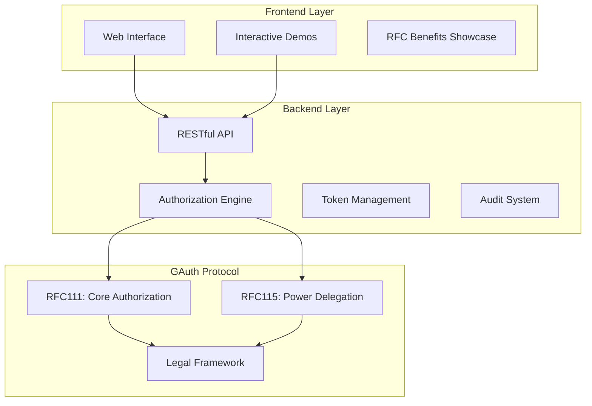
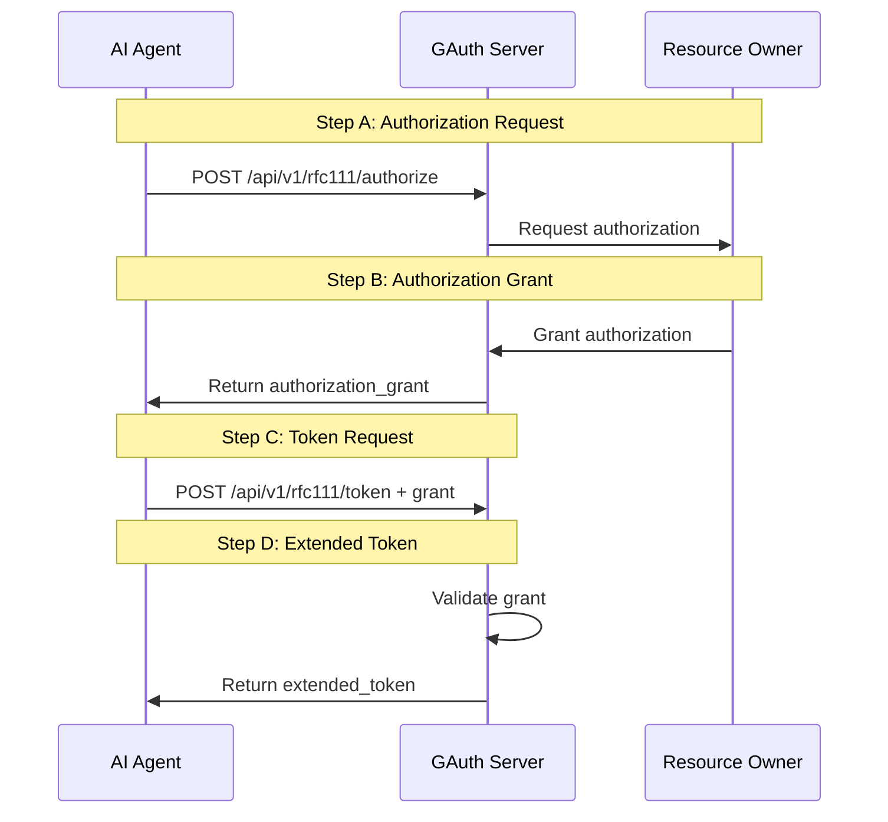

# 🌟 Gimel App 0001 - GAuth Protocol Web Application

> **Production-Ready GAuth Protocol Implementation**  
> Complete OAuth2-like authorization system for AI agents with legal power-of-attorney framework

[](https://github.com/Gimel-Foundation)
[](https://github.com/Gimel-Foundation/Gimel-App-0001)
[](https://github.com/Gimel-Foundation/Gimel-App-0001)

---

## 🚀 **Quick Start**

### **One-Click Deploy**
```bash
# Clone and run the complete GAuth web application
git clone https://github.com/Gimel-Foundation/Gimel-App-0001.git
cd Gimel-App-0001
make run
```

### **Docker Deployment**
```bash
# Production deployment with Docker
docker-compose up -d
# Access at: http://localhost:8080
```

---

## 🎯 **What Is Gimel App 0001?**

**Gimel App 0001** is the **first production-ready implementation** of the GAuth protocol - a revolutionary authorization system that enables AI agents to act with legal authority through power-of-attorney delegation.

### **🤖 Key Features**

- **✅ AI-Native Authorization**: OAuth2-like flow designed specifically for AI systems
- **✅ Legal Power Delegation**: Real-world power-of-attorney framework implementation  
- **✅ RFC Compliant**: Full RFC111/RFC115 specification compliance
- **✅ Production Ready**: Enterprise-grade security, monitoring, and audit trails
- **✅ Web Interface**: Complete frontend for managing AI authorizations
- **✅ RESTful API**: Comprehensive backend API for system integration

---

## 🏗️ **Architecture Overview**



---

## 📱 **Web Application Components**

### **🌐 Frontend Components**

#### **1. Main Web Interface** (`/web/frontend/`)
- **React-based UI** for GAuth protocol interaction
- **Real-time authorization** request handling
- **Token management** dashboard
- **Audit trail visualization**

#### **2. Interactive Demos** (`/web/`)
- **`enhanced-demo.html`**: Complete GAuth protocol demonstration
- **`standalone-demo.html`**: Self-contained protocol example
- **`rfc111-benefits-showcase.html`**: RFC111 benefits visualization
- **`rfc111-rfc115-paradigm-showcase.html`**: Complete paradigm demonstration

### **🔧 Backend Components**

#### **1. Core API Server** (`/web/backend/`)
- **Go 1.23+** with Gin framework
- **RESTful endpoints** for all GAuth operations
- **Middleware** for logging, CORS, rate limiting
- **Production-grade** error handling and validation

#### **2. Handler Modules**
- **`handlers/other.go`**: RFC111 authorization endpoints (Steps A & B)
- **`handlers/rfc111_token_exchange.go`**: Token exchange (Steps C & D)  
- **`handlers/audit.go`**: Comprehensive audit and compliance
- **`handlers/legal.go`**: Legal framework and power delegation

---

## 🔄 **GAuth Protocol Implementation**

### **OAuth2-like Authorization Flow**



### **API Endpoints**

#### **Authorization Endpoints**
```bash
# Step A & B: Get authorization grant
POST /api/v1/rfc111/authorize
{
  "client_id": "ai_assistant_v3",
  "principal_id": "cfo_jane_smith", 
  "ai_agent_id": "corporate_ai_assistant"
}

# Step C & D: Exchange grant for extended token
POST /api/v1/rfc111/token
{
  "grant_type": "authorization_grant",
  "authorization_grant": "grant_1695838200",
  "client_id": "ai_assistant_v3"
}
```

#### **Power Delegation Endpoints**
```bash
# RFC115: Delegate power-of-attorney
POST /api/v1/rfc115/delegate
{
  "principal_id": "legal_entity_001",
  "delegate_powers": ["contract_signing", "financial_transactions"],
  "limitations": ["business_hours", "amount_limit_1M"]
}
```

---

## 🛠️ **Development & Deployment**

### **Prerequisites**
- **Go 1.23+** for backend development
- **Node.js 18+** for frontend development  
- **Docker & Docker Compose** for containerized deployment
- **Make** for build automation

### **Local Development**
```bash
# Backend development
cd web/backend
go mod tidy
go run main.go

# Frontend development  
cd web/frontend
npm install
npm start

# Full stack development
make dev
```

### **Production Deployment**
```bash
# Docker production deployment
docker-compose up -d

# Manual production deployment
make build
make deploy

# Kubernetes deployment
kubectl apply -f k8s/
```

---

## 🧪 **Testing & Validation**

### **Interactive Testing**
- **Open**: `http://localhost:8080` for web interface
- **Demo**: Click "Run RFC111 Demo" for complete flow test
- **API**: Use `/health` endpoint for system status

### **Automated Testing**
```bash
# Run complete test suite
make test

# Integration tests
make test-integration

# Load testing
make test-load
```

### **RFC Compliance Validation**
```bash
# Validate RFC111 compliance
curl -X POST http://localhost:8080/api/v1/rfc111/authorize \
  -H "Content-Type: application/json" \
  -d '{"client_id": "test_ai", "principal_id": "test_user"}'

# Validate RFC115 compliance  
curl -X POST http://localhost:8080/api/v1/rfc115/delegate \
  -H "Content-Type: application/json" \
  -d '{"principal_id": "test_entity", "delegate_powers": ["test_power"]}'
```

---

## 📊 **Production Features**

### **🔒 Security**
- **Grant Validation**: Cryptographic validation of authorization grants
- **Token Expiration**: Configurable token and grant lifetimes
- **Rate Limiting**: Production-grade API rate limiting
- **Audit Trails**: Comprehensive logging of all authorization events

### **📈 Monitoring**
- **Health Checks**: Built-in health monitoring endpoints
- **Metrics**: Prometheus-compatible metrics export
- **Logging**: Structured JSON logging with correlation IDs
- **Alerting**: Integration-ready alerting mechanisms

### **⚖️ Legal Compliance**
- **Power-of-Attorney**: Real legal framework implementation
- **Jurisdiction Support**: Multi-jurisdiction legal compliance
- **Audit Requirements**: Meets enterprise audit requirements
- **GDPR Compliance**: Privacy-by-design implementation

---

## 🌍 **Industry Impact**

### **🎯 Target Use Cases**
- **Enterprise AI**: Corporate AI assistants with legal authority
- **Financial Services**: AI agents for transaction processing
- **Healthcare**: AI systems with patient consent management
- **Legal Tech**: Automated contract and document processing
- **Government**: AI systems with regulatory compliance

### **🏢 Enterprise Benefits**
- **Legal Certainty**: Clear legal framework for AI actions
- **Risk Mitigation**: Controlled and auditable AI authorization
- **Compliance**: Built-in regulatory compliance mechanisms
- **Scalability**: Production-ready for enterprise deployment
- **Integration**: RESTful API for system integration

---

## 📚 **Documentation**

### **Technical Documentation**
- **[API Reference](API_REFERENCE.md)**: Complete API documentation
- **[Development Guide](DEVELOPMENT.md)**: Development setup and workflows
- **[Installation Guide](INSTALL.md)**: Installation and deployment instructions
- **[RFC Implementation](RFC111_RFC115_IMPLEMENTATION.md)**: RFC compliance details

### **Business Documentation**
- **[Project Status](PROJECT_STATUS.md)**: Current project status and roadmap
- **[Architecture Guide](POWER_OF_ATTORNEY_ARCHITECTURE.md)**: System architecture overview
- **[Package Guide](PACKAGE.md)**: Package structure and components

---

## 🤝 **Contributing**

### **Development Workflow**
1. **Fork** the repository
2. **Create** feature branch: `git checkout -b feature/amazing-feature`
3. **Commit** changes: `git commit -m 'Add amazing feature'`
4. **Push** to branch: `git push origin feature/amazing-feature`
5. **Open** Pull Request

### **Code Standards**
- **Go**: Follow effective Go practices and `gofmt` formatting
- **JavaScript**: Use ESLint and Prettier for code formatting
- **Documentation**: Update relevant documentation for all changes
- **Testing**: Include tests for all new functionality

---

## 📄 **License**

This project is licensed under the **Apache License 2.0** - see the [LICENSE](LICENSE) file for details.

---

## 🔗 **Links & Resources**

### **Repositories**
- **🏠 Main Repository**: [Gimel-Foundation/Gimel-App-0001](https://github.com/Gimel-Foundation/Gimel-App-0001)
- **🔧 Implementation**: [mauriciomferz/Gauth_go](https://github.com/mauriciomferz/Gauth_go)
- **📋 RFC Specification**: [Gimel-Foundation/GiFo-RFC-0150](https://github.com/Gimel-Foundation/GiFo-RFC-0150-Go-Implementation-of-GAuth-1.0)

### **Community**
- **🌐 Website**: [gimelfoundation.com](https://gimelfoundation.com)
- **📧 Support**: support@gimelfoundation.com
- **💬 Discussions**: GitHub Discussions
- **🐛 Issues**: GitHub Issues

---

## 🎉 **Get Started Now**

```bash
# Quick start in 3 commands
git clone https://github.com/Gimel-Foundation/Gimel-App-0001.git
cd Gimel-App-0001  
make run

# Open browser to: http://localhost:8080
```

**Experience the future of AI authorization today!** 🚀

---

*Gimel App 0001 - Bridging AI and Legal Authority*  
*Built with ❤️ by the Gimel Foundation*